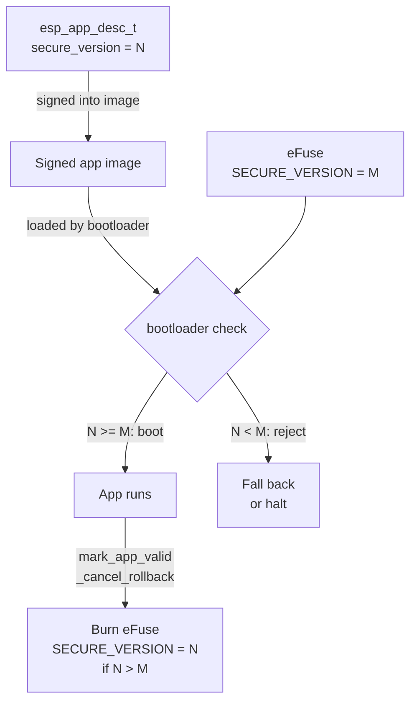

*Secure Boot stops an attacker from loading unsigned firmware. It does not stop them from loading a signed, older, known-vulnerable firmware. That is what anti-rollback is for. This post is the lab writeup for doing it properly, attacking it, and then hardening it.*

*Prerequisite reading: [Secure Boot and the Chain of Trust on ESP32-S3](/blog/secureboot-chain-of-trust-esp32). Anti-rollback sits on top of Secure Boot v2 and Flash Encryption. Without those, none of this matters.*

---

### <span style="color: orange;">Why Anti-Rollback Is a Real Attack, Not a Paper One</span>

The workflow an attacker uses on a device with Secure Boot enabled but no rollback protection:

1. Dump the deployed firmware (or just download a vendor OTA archive).
2. Find an older official build, still signed with the same key, that contains a CVE the current build fixed.
3. Flash the older image via UART, OTA, or a physical programmer.
4. The bootloader checks the signature. It is valid. The device boots the vulnerable build.
5. Exploit the CVE that was patched six months ago.

The signature is not the problem. The key was not stolen. The chain of trust did its job. The device was simply not asked to check **which version** of the signed firmware it was being handed.

Anti-rollback is the policy layer that says: I will only boot firmware with a security version number greater than or equal to the highest one I have ever seen.

---

### <span style="color: orange;">Lab Setup</span>

Hardware and tools for this lab:

- ESP32-S3-DevKitC-1 (N8R8 or N16R8)
- USB-C cable
- ESP-IDF v5.2 or newer
- A spare devkit you do not mind burning eFuses on (this is one-way)
- Optional: CH340-based UART adapter, logic analyzer, bench PSU for glitching experiments

Project skeleton:

```bash
. ~/esp/esp-idf/export.sh
idf.py create-project rollback_lab
cd rollback_lab
idf.py set-target esp32s3
```

We will ship three firmware builds in this lab:

- `fw-v1-vuln` with security version 0, contains a deliberate "vulnerable" endpoint
- `fw-v2-patched` with security version 1, removes the endpoint
- `fw-v3-hardened` with security version 2, adds rollback policy

---

### <span style="color: orange;">Where the Version Number Actually Lives</span>

Anti-rollback on ESP32-S3 is enforced with an eFuse counter and an application descriptor field. Both sides have to line up.



The eFuse field on ESP32-S3 used for app rollback is `SECURE_VERSION` (16 bits, monotonic, burned as a unary counter so each bump consumes one bit). Once burned to value M, no firmware with `secure_version < M` will ever pass the bootloader check on this chip again.

---

### <span style="color: orange;">Implement It: sdkconfig, Descriptor, OTA</span>

Enable the features in `menuconfig` (or directly in `sdkconfig`):

```
CONFIG_SECURE_BOOT=y
CONFIG_SECURE_BOOT_V2_ENABLED=y
CONFIG_SECURE_FLASH_ENC_ENABLED=y
CONFIG_SECURE_FLASH_ENCRYPTION_MODE_RELEASE=y
CONFIG_BOOTLOADER_APP_ANTI_ROLLBACK=y
CONFIG_BOOTLOADER_APP_SECURE_VERSION=1
CONFIG_BOOTLOADER_APP_SECURE_VERSION_SIZE_EFUSE_FIELD=16
CONFIG_APP_ROLLBACK_ENABLE=y
```

What these do, in plain terms:

- `BOOTLOADER_APP_ANTI_ROLLBACK=y` tells the bootloader to compare the app descriptor version against the eFuse and reject if lower.
- `BOOTLOADER_APP_SECURE_VERSION=1` is the security version baked into **this build**.
- `APP_ROLLBACK_ENABLE=y` enables the confirm-or-rollback flow on OTA: a new image boots in `PENDING_VERIFY`; if it crashes or never calls `esp_ota_mark_app_valid_cancel_rollback`, the previous slot is booted on the next reset.

The version is embedded in the signed image header via `esp_app_desc_t`:

```c
const esp_app_desc_t *desc = esp_app_get_description();
ESP_LOGI("rollback", "app ver %s, secure_ver %d",
         desc->version, desc->secure_version);
```

Partition table must include two OTA slots plus `otadata`:

```
# Name,   Type, SubType,  Offset,   Size,     Flags
nvs,      data, nvs,      0x9000,   0x6000,
otadata,  data, ota,      0xf000,   0x2000,
phy_init, data, phy,      0x11000,  0x1000,
ota_0,    app,  ota_0,    0x20000,  0x180000, encrypted
ota_1,    app,  ota_1,    0x1A0000, 0x180000, encrypted
```

Build and flash the first image, then bump `CONFIG_BOOTLOADER_APP_SECURE_VERSION` to 2 and push as OTA. The first time the new image confirms itself, the bootloader burns one bit in `SECURE_VERSION` eFuse. From that moment, the v1 image is dead on this chip.

Confirm code in the app side, typically after a successful self-test:

```c
void app_main(void) {
    // run self-checks, network health, sensor sanity, etc.
    if (self_tests_passed()) {
        esp_ota_mark_app_valid_cancel_rollback();
    }
    // if we never call this, a watchdog reset triggers rollback
}
```

Read the eFuse at any time:

```bash
espefuse.py --chip esp32s3 summary | grep -i secure_version
```

---

### <span style="color: orange;">Now Break It: Realistic Bypass Attempts</span>

With the lab built, these are the bypasses an attacker would actually try, in order of effort. I ran each against the lab board.

**Attempt 1: Reflash v1 over UART.**
Result: bootloader logs `secure_version is lower than stored in efuse`, image rejected, chip falls back or halts depending on the other slot's state. Expected outcome. Anti-rollback working as designed.

**Attempt 2: Flash v1 with a new signature using a leaked signing key.**
Result: signature verifies, but the bootloader still compares `esp_app_desc_t.secure_version` against the eFuse. Rejected. This is the key point people miss: **Secure Boot and anti-rollback are independent checks**. Compromising the signing key does not give you a rollback.

**Attempt 3: Patch `secure_version` in the image before re-signing.**
Result: attacker sets `secure_version = 0xFFFF` to satisfy the bootloader check. The image now claims to be the highest version ever, boots once, and calls `esp_ota_mark_app_valid_cancel_rollback()`. This burns the eFuse to `0xFFFF`. The device is now pinned to "fake v65535" and legitimate future OTAs with version 3, 4, 5 will be rejected forever.
**This is not a bypass of the policy, it is a denial-of-service via the policy itself**, and it requires the signing key, which is the same prerequisite as compromising the device completely. So in practice: requires root-of-trust compromise, and the observable effect is bricking, not silent downgrade.

**Attempt 4: Glitch the bootloader version check.**
Location: inside `bootloader_common_check_chip_validity` and the anti-rollback compare in `esp_secure_boot_verify_signature` path. An EMFI or voltage glitch at the exact cycle of the compare can skip the reject. Feasible with a ChipWhisperer + bench setup, non-trivial on a production board with decoupling caps and short traces, but not impossible. The known public ESP32 glitching work (Raelize, LimitedResults) demonstrates the class on the original ESP32. ESP32-S3 has additional mitigations but glitching is not eliminated.
Result in my lab with a cheap CH32-based crowbar: intermittent success on a decapped chip, no success on a stock devkit in 2 hours of attempts. Your results will vary.

**Attempt 5: Downgrade the bootloader itself.**
The bootloader has its own version eFuse (`SECURE_BOOT_V2_EN` locks the scheme, and `SECURE_BOOT_DISABLE_FAST_WAKE` style fuses), and optionally `SECURE_BOOT_AGGRESSIVE_REVOKE`. Without bootloader anti-rollback (separate config: `CONFIG_BOOTLOADER_APP_ROLLBACK_ENABLE` for app, `CONFIG_SECURE_BOOT_FLASH_BOOTLOADER_DEFAULT=...` for bootloader), an attacker with the key can reflash an older **bootloader** that does not enforce app anti-rollback at all.
Result: if you only enabled app-level anti-rollback and left the bootloader slot writable, a signed-but-older bootloader swap removes the check entirely. Confirmed in lab.

**Attempt 6: Dump, modify the eFuse "shadow", and hope.**
eFuse values are latched into shadow registers at boot. Can I write the shadow to pretend `SECURE_VERSION` is 0? The shadow is writable at runtime but only affects the current boot, and the hardware compare on reboot uses the physical fuses. Also, `WR_DIS` and `RD_DIS` get set in release mode. This path is a dead end on a correctly provisioned chip.

**Attempt 7: Supply chain downgrade via OTA server.**
If the OTA server is compromised or the OTA client does not pin the version it accepts, an attacker can serve a legitimately signed v1 image. The bootloader will reject it. The **app** will happily download it, write it to the inactive slot, set otadata, and reboot into a device that now refuses to boot either slot (if the other slot is also older than eFuse). That is another DoS path.
Result: server-side downgrade is not a bypass of anti-rollback, but it is a way to turn anti-rollback into a brick. The fix is client-side: check `secure_version` of the candidate image **before** writing it to flash.

---

### <span style="color: orange;">The Mitigations That Actually Close the Gaps</span>

Mapping each bypass above to the fix that kills it.

**1. For the "patch secure_version to 0xFFFF then burn the fuse" attack:**
Do not use the full 16 bits as a linear counter. Reserve headroom. ESP-IDF lets you cap the max version the bootloader will accept beyond a sanity threshold. Better, use **staged release keys**: revoke the signing key the moment you detect a leaked build. The aggressive key revocation path on ESP32-S3 Secure Boot v2 supports this.

**2. For bootloader-swap downgrade:**
Enable bootloader anti-rollback, not just app. In ESP-IDF this is `CONFIG_SECURE_BOOT_ALLOW_ROM_BASIC=n` plus locking the bootloader eFuse group, plus writing the bootloader partition as read-protected in release mode. Practically: `espefuse.py --chip esp32s3 write_protect_efuse SECURE_BOOT_EN`, `DIS_DOWNLOAD_MODE=1`, `DIS_LEGACY_SPI_BOOT=1`.

**3. For glitching:**
No firmware-only fix makes glitching free. Mitigations that raise cost:

- Redundant checks: verify version twice, in different code paths, with different register usage. ESP-IDF does this in recent versions but custom bootloaders often do not.
- Random delays before the compare instruction.
- Brownout detector enabled (`CONFIG_ESP_BROWNOUT_DET=y`) at the highest sensible threshold.
- Physical: potting compound, tamper mesh, shorter power rail traces, decoupling cap placement.
- Assume glitching is possible and design the rest of the system to be useful even after a single-device compromise (per-device keys, attestation, revocation).

**4. For OTA-server-pushed brick-via-older-signed-image:**
Client side: before writing any OTA chunk, parse the image header, read `secure_version`, compare against `esp_efuse_read_secure_version()`. Abort the OTA if the candidate is lower. This is a three-line change and it prevents both accidental regressions and the DoS path.

```c
esp_app_desc_t new_desc;
esp_ota_get_partition_description(update_partition, &new_desc);
uint32_t current = 0;
esp_efuse_read_field_blob(ESP_EFUSE_SECURE_VERSION, &current, 16);
if (new_desc.secure_version < current) {
    ESP_LOGE("ota", "refusing to flash older secure_version %lu < %lu",
             (unsigned long)new_desc.secure_version, (unsigned long)current);
    esp_ota_abort(update_handle);
    return ESP_ERR_INVALID_VERSION;
}
```

**5. For the "burn-too-aggressively" class of policy errors:**
Only call `esp_ota_mark_app_valid_cancel_rollback()` after a meaningful self-test. Do not call it in the first line of `app_main`. The OTA pending-verify window is the last chance to reject a broken or malicious-but-signed image, and burning the eFuse is permanent for this device.

**6. For physical readback of `esp_app_desc`:**
Enable flash encryption in release mode so the descriptor and signature block are encrypted at rest. Without this, an attacker who lifts the flash chip can read the descriptor and plan targeted attacks.

---

### <span style="color: orange;">The Pre-Ship Checklist for Anti-Rollback</span>

- [ ] Secure Boot v2 enabled and eFuse burned
- [ ] Flash Encryption in RELEASE mode
- [ ] `BOOTLOADER_APP_ANTI_ROLLBACK=y`
- [ ] `APP_ROLLBACK_ENABLE=y` and a real self-test gating `mark_app_valid`
- [ ] `secure_version` bumped in every release, tracked in CI
- [ ] OTA client checks candidate `secure_version` **before** flashing
- [ ] Bootloader eFuse write-protected, `DIS_DOWNLOAD_MODE=1`, `DIS_LEGACY_SPI_BOOT=1`
- [ ] Signing key stored in HSM, with documented revocation path
- [ ] Release key separated from debug key, debug key revoked before shipping
- [ ] Brownout detector at production threshold
- [ ] Private key leak incident response documented and rehearsed

If any of those are unchecked, the device is rollback-vulnerable in practice even if the feature is "enabled" in `sdkconfig`.

---

### <span style="color: orange;">The Honest Summary</span>

Anti-rollback on ESP32-S3 is solid when it is configured end-to-end and paired with a disciplined OTA client. The feature does what it says. What breaks in the field is almost never the eFuse compare itself. It is the three assumptions around it:

- That the OTA client refuses older images (most do not)
- That the bootloader is also rollback-protected (most firmware teams only do the app)
- That the signing key cannot be abused to burn the eFuse to a max value (forgotten threat model)

Close those three, keep the signing key in an HSM, and the attacker is left with glitching, which is expensive, per-device, and does not scale.

That is the point of defense in depth: make the cheap attacks impossible and the expensive attacks not worth it.

Next in this track: flash encryption key provisioning pitfalls, and a separate post on how to structure an OTA pipeline so version bumps are automatic and unbumpable releases are rejected in CI.

---

*Lab gear: ESP32-S3-DevKitC-1, ESP-IDF 5.2, ChipWhisperer-Lite for the glitching attempts. All experiments on personal boards under my own control.*
