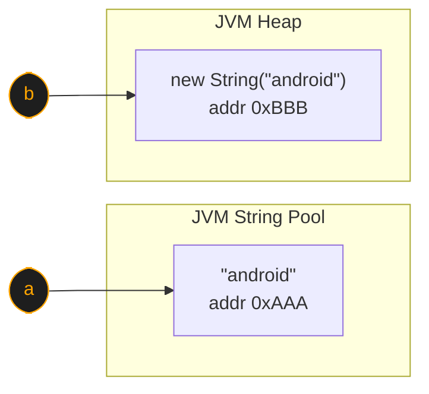

*One operator. Eight characters. Every Android device on the fleet, lying about itself on every single connection. No log, no error, no warning - just bad telemetry forever.*

---

### The Bug in One Line

**SDK:** `aws-iot-device-sdk-java-v2`
**File:** `AwsIotMqtt5ClientBuilder.java:1121`
**CWE:** [CWE-597 - Use of Wrong Operator in String Comparison](https://cwe.mitre.org/data/definitions/597.html)
**CVSS:** 5.3 Medium
**Affects:** All Android devices using this SDK

```java
// AwsIotMqtt5ClientBuilder.java:1121
if(CRT.getOSIdentifier() == "android"){   // ← always false
```

That single `==` instead of `.equals()` means **every Android IoT device** connecting to AWS IoT Core silently reports itself as `SDK=JavaV2` instead of `SDK=AndroidV2`. No error. No warning. No log. Just wrong data on every connection, forever.

The full runnable testbed (Java sources + compiled classes) lives at [github.com/V33RU/writeups/tree/main/blog-cwe597](https://github.com/V33RU/writeups/tree/main/blog-cwe597). You can clone it and reproduce every claim in this post on a stock JDK 11+ install - no Maven, no AWS account, no dependencies.

---

### Background: What This SDK Actually Does

The [aws-iot-device-sdk-java-v2](https://github.com/aws/aws-iot-device-sdk-java-v2) is Amazon's official Java SDK for IoT devices. It runs on:

- Android phones and tablets used as IoT controllers
- Raspberry Pi and other Linux-based edge devices
- Windows IoT devices

When a device connects to AWS IoT Core it sends an **MQTT CONNECT** packet. Inside that packet is a `username` field that carries metadata about the device - including which SDK it is using. AWS IoT Core reads this to power fleet indexing, IoT Rules, and telemetry dashboards.

The `username` field is built by `AwsIotMqtt5ClientBuilder` and on Android *should* look like this:

```
?SDK=AndroidV2&Version=1.19.0
```

It does not. Not on a single Android device. Ever.

---

### The Java Concept at the Root of This Bug

To understand why, you need to understand how Java handles String comparison.

#### `==` vs `.equals()` - the most common Java mistake

In Java, everything is an object. Strings are no different.

```java
String a = "android";             // stored in JVM String Pool
String b = new String("android"); // created on the Heap
```

Both variables hold the text `"android"` but they are **different objects in memory**.



| Comparison | What it checks | Result |
|---|---|---|
| `a == b` | `0xAAA` vs `0xBBB` (addresses) | `false` |
| `a.equals(b)` | `"android"` vs `"android"` (characters) | `true` |

Now:

```java
a == b           // false - compares memory addresses 0xAAA vs 0xBBB
a.equals(b)      // true  - compares the actual characters
```

| Operator | What it compares | Correct for Strings? |
|---|---|---|
| `==` | Memory address (same object?) | No |
| `.equals()` | Character content (same value?) | Yes |

**Rule: always use `.equals()` to compare String values in Java.**

[`Part1_JavaStringBasics.java`](https://github.com/V33RU/writeups/blob/main/blog-cwe597/Part1_JavaStringBasics.java) walks through this with live memory addresses you can see for yourself.

---

### Why JNI Native Methods Make This 100% Reproducible

The AWS CRT library (`aws-crt-java`) is written in C/C++ and exposed to Java through JNI (Java Native Interface). When a native method returns a String to Java it creates a **brand new heap object**. It cannot return an interned pool string.

In C/C++ JNI code, creating a Java string looks like this:

```c
JNIEXPORT jstring JNICALL
Java_CRT_getOSIdentifier(JNIEnv *env, jclass cls) {
    return env->NewStringUTF("android");
    //          ↑
    //    Always creates a NEW heap object [0xBBB]
    //    Never returns the interned pool string [0xAAA]
}
```

So when the SDK does this:

```java
if(CRT.getOSIdentifier() == "android")
//   ↑                       ↑
//   heap [0xBBB]           pool [0xAAA]
//   0xBBB == 0xAAA  →  false  ALWAYS
```

The result is `false` every single time - not sometimes, not under load, not on certain JVMs - **always**. This is a deterministic bug, not a race condition or edge case.

[`Part3_WhyNativeMethodsMakeItWorse.java`](https://github.com/V33RU/writeups/blob/main/blog-cwe597/Part3_WhyNativeMethodsMakeItWorse.java) simulates the JNI return path so you can watch the addresses diverge.

---

### The Vulnerable Code in Context

Here is the full vulnerable block:

```java
// AwsIotMqtt5ClientBuilder.java lines 1121-1125
if(CRT.getOSIdentifier() == "android"){             // ← BUG
    addToUsernameParam(paramList, "SDK", "AndroidV2");
} else {
    addToUsernameParam(paramList, "SDK", "JavaV2"); // ← always taken
}
addToUsernameParam(paramList, "Version", new PackageInfo().version.toString());

return formUsernameFromParam(paramList);
```

`formUsernameFromParam` then assembles the final username string that gets embedded into the MQTT CONNECT packet. Every Android device always hits the `else` branch and ships `SDK=JavaV2`.

---

### The Impact: A Fleet of 10 Devices

Imagine 10 IoT devices connecting to AWS IoT Core - 6 Android, 4 non-Android.

#### What AWS IoT Core actually receives (BUGGY)

```
device-001  │ android  │ ?SDK=JavaV2&Version=1.19.0   ← WRONG
device-002  │ android  │ ?SDK=JavaV2&Version=1.19.0   ← WRONG
device-003  │ android  │ ?SDK=JavaV2&Version=1.20.0   ← WRONG
device-004  │ linux    │ ?SDK=JavaV2&Version=1.19.0   OK
device-005  │ linux    │ ?SDK=JavaV2&Version=1.20.0   OK
device-006  │ windows  │ ?SDK=JavaV2&Version=1.19.0   OK
device-007  │ android  │ ?SDK=JavaV2&Version=1.20.0   ← WRONG
device-008  │ android  │ ?SDK=JavaV2&Version=1.20.0   ← WRONG
device-009  │ linux    │ ?SDK=JavaV2&Version=1.20.0   OK
device-010  │ android  │ ?SDK=JavaV2&Version=1.18.0   ← WRONG

Fleet Index:  AndroidV2 = 0,  JavaV2 = 10
```

#### What AWS IoT Core *should* receive (FIXED)

```
device-001  │ android  │ ?SDK=AndroidV2&Version=1.19.0
device-002  │ android  │ ?SDK=AndroidV2&Version=1.19.0
device-003  │ android  │ ?SDK=AndroidV2&Version=1.20.0
device-004  │ linux    │ ?SDK=JavaV2&Version=1.19.0
...

Fleet Index:  AndroidV2 = 6,  JavaV2 = 4
```

#### Downstream consequences

**1. Fleet indexing returns nothing for Android.** Any query like:

```sql
SELECT * FROM 'iot:fleet' WHERE attributes.SDK = 'AndroidV2'
```

returns zero rows - even with six Android devices online.

**2. IoT Rules silently fail.** A rule designed to alert on outdated Android SDKs:

```sql
SELECT * FROM '$aws/events/presence/connected/+'
WHERE username LIKE '%SDK=AndroidV2%' AND username LIKE '%Version=1.18%'
```

Never fires. The operator never gets paged. The outdated device on `1.18` keeps running.

**3. SDK adoption metrics are corrupted.** Amazon itself uses the `SDK=` tag to track platform adoption. The dashboard shows zero Android adoption - which can quietly misinform AWS's own roadmap decisions.

**4. Zero visibility.** No exception, no log, no warning. The device operator has no way of knowing this is happening. Everything *looks* fine.

The full simulation - fleet index, rule engine, before/after diff - is in [`Part4_Testbed.java`](https://github.com/V33RU/writeups/blob/main/blog-cwe597/Part4_Testbed.java).

---

### The Fix

One word:

```diff
// AwsIotMqtt5ClientBuilder.java:1121
- if(CRT.getOSIdentifier() == "android"){
+ if(CRT.getOSIdentifier().equals("android")){
```

`.equals()` compares the actual character content of the string regardless of which object in memory it came from. That is all this bug ever needed.

---

### Running the Testbed

Everything in this post is reproducible on a stock JDK. No Maven, no dependencies, no AWS account.

```bash
git clone https://github.com/V33RU/writeups.git
cd writeups/blog-cwe597

javac Part1_JavaStringBasics.java
javac Part2_TheActualBug.java
javac Part3_WhyNativeMethodsMakeItWorse.java
javac Part4_Testbed.java
javac RunAll.java
```

Run the parts individually:

```bash
java Part1_JavaStringBasics            # == vs .equals() with memory addresses
java Part2_TheActualBug                # the bug in SDK context, 3 platforms
java Part3_WhyNativeMethodsMakeItWorse # why JNI makes it 100% reproducible
java Part4_Testbed                     # fleet sim - what AWS IoT Core sees
```

Or run everything at once:

```bash
java RunAll
```

| File | What you learn |
|---|---|
| [`Part1_JavaStringBasics.java`](https://github.com/V33RU/writeups/blob/main/blog-cwe597/Part1_JavaStringBasics.java) | `==` vs `.equals()` with live memory diagrams |
| [`Part2_TheActualBug.java`](https://github.com/V33RU/writeups/blob/main/blog-cwe597/Part2_TheActualBug.java) | The exact bug in SDK context, three platforms side by side |
| [`Part3_WhyNativeMethodsMakeItWorse.java`](https://github.com/V33RU/writeups/blob/main/blog-cwe597/Part3_WhyNativeMethodsMakeItWorse.java) | Why JNI native methods make it 100% reproducible |
| [`Part4_Testbed.java`](https://github.com/V33RU/writeups/blob/main/blog-cwe597/Part4_Testbed.java) | Full fleet simulation - what AWS IoT Core actually receives |

---

### Detection

Every major Java static analysis tool catches this class of bug:

| Tool | Rule |
|---|---|
| SpotBugs | `ES_COMPARING_STRINGS_WITH_EQ` |
| SonarQube | `java:S4973` |
| IntelliJ IDEA | Built-in inspection |
| PMD | `UseEqualsToCompareStrings` |

If SpotBugs or SonarQube were running on the SDK's CI pipeline, this never ships. That is the real lesson - not "remember `.equals()`," because every Java developer already knows that. The lesson is **make the machine remember it for you.**

---

### Key Takeaways

1. **Never use `==` to compare String values in Java.** Always use `.equals()`.
2. **Native (JNI) methods always return heap objects.** They can never return interned pool strings. Any `==` against a literal is always `false`.
3. **Silent bugs are the most dangerous.** No exception, no error, no log - metadata gets corrupted on every connection and nobody knows.
4. **One character can affect an entire fleet.** Eight keystrokes - `==` to `.equals()` - vs every Android IoT device on every MQTT connection.
5. **Run static analysis in CI.** SpotBugs would have caught this before it shipped.

---

### References

- [Testbed source on GitHub - V33RU/writeups/blog-cwe597](https://github.com/V33RU/writeups/tree/main/blog-cwe597)
- [CWE-597: Use of Wrong Operator in String Comparison](https://cwe.mitre.org/data/definitions/597.html)
- [Vulnerable line in aws-iot-device-sdk-java-v2](https://github.com/aws/aws-iot-device-sdk-java-v2/blob/main/sdk/src/main/java/software/amazon/awssdk/iot/AwsIotMqtt5ClientBuilder.java#L1121)
- [Java Language Specification §15.21.3 - Reference Equality](https://docs.oracle.com/javase/specs/jls/se17/html/jls-15.html#jls-15.21.3)
- [SpotBugs ES_COMPARING_STRINGS_WITH_EQ](https://spotbugs.readthedocs.io/en/latest/bugDescriptions.html)
- [SonarQube java:S4973](https://rules.sonarsource.com/java/RSPEC-4973/)
