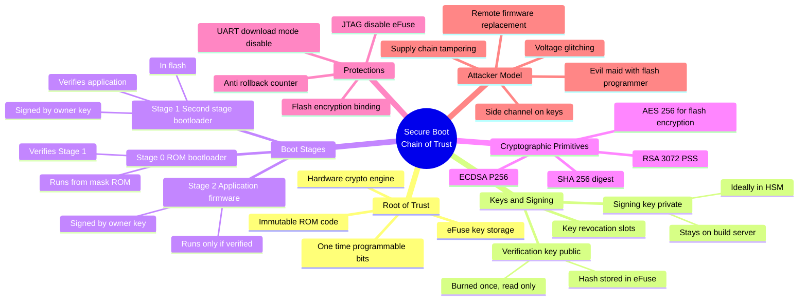

*A lot of IoT vendors put "secure boot supported" on the datasheet and stop there. This post is about what that line actually means, what it does for you, what it does not do for you, and how to reason about it at the level of the silicon. I am using ESP32 Secure Boot v2 as the concrete example because it is the most accessible, best documented, and most widely shipped secure boot implementation in the consumer IoT world.*

### <span class="accent-orange">What Secure Boot Actually Is</span>

Secure boot is a cryptographic verification chain that runs every time the device powers on, and its only job is to answer one question.

"Is the software that is about to run on this chip the software that the legitimate owner of this device signed."

If the answer is yes, the chip runs the code. If the answer is no, the chip halts, reboots, or enters a recovery state. That is it. That is the entire feature.

The word "chain" is the important part. Secure boot is not one check. It is a sequence of checks, where each stage verifies the next stage before handing execution over. If any link in the chain breaks, the whole chain is broken. The hero image for this post is the right metaphor. A chain is exactly as strong as its weakest link, and the lock at the bottom does nothing if the chain above it is already cut.

### <span class="accent-orange">The Chain of Trust, as a Mindmap</span>

Here is the full picture of what is involved, laid out as a mindmap. Save this and come back to it while reading the rest of the post.



The mindmap splits into six branches. Root of trust, keys, boot stages, crypto, protections, and attacker model. A real secure boot implementation has to have something defensible in all six branches. Missing any one of them breaks the chain.

### <span class="accent-orange">The Root of Trust, and Why It Has to Be Hardware</span>

Every secure boot scheme begins with a thing that cannot be modified by software. Usually this is mask ROM, ich is code literally etched into the silicon at fabrication time, and a small region of one-time-programmable fuses that store the public key hash.

Why mask ROM. Because if the first code that runs can be replaced, nothing after it can be trusted. If I can rewrite the bootloader, I can make it say "signature valid" for any image I want. So the first check has to happen in code that physically cannot be rewritten.

Why eFuse, not flash. Flash can be reprogrammed with a $5 CH341A off Amazon. eFuse bits are burned with a programming voltage and cannot be reset. Once you write a 1 to a fuse bit, it is a 1 forever. This is where the public key hash, revocation state, and the "secure boot is enabled" flag live.

The entire trust model rests on two assumptions.

One, that the mask ROM is correct. If there is a bug in the ROM code, no amount of signing fixes it, because you cannot patch mask ROM in the field. This is exactly what happened with ESP32 classic and the CVE-2019-15894 UART download bypass. The ROM shipped. The bug shipped. Every chip already fabricated was affected.

Two, that the eFuse bits cannot be tampered with in a way the attacker can benefit from. Modern parts include glitching countermeasures and fuse readback checks specifically because this assumption has been attacked for years.

### <span class="accent-orange">How the Chain Executes, Step by Step</span>

Here is what actually happens between pressing power and your application running, on a chip with secure boot enabled.

1. The chip powers on. The CPU starts executing at a fixed address in mask ROM.
2. The ROM code reads a "secure boot enabled" fuse bit. If it is zero, the chip is in dev mode and the rest of this process is skipped. If it is one, secure boot is enforced for the rest of boot.
3. The ROM loads the second stage bootloader from flash into RAM.
4. The ROM computes a SHA-256 digest of the bootloader image.
5. The ROM reads the bootloader's signature block, which contains an RSA-3072 signature and the embedded public key.
6. The ROM computes a SHA-256 of that embedded public key, and compares it against the public key hash stored in eFuse. If it does not match, boot halts. This is the link that makes the whole thing work. The eFuse hash is what anchors the RSA key to this specific device.
7. If the hash matches, the ROM verifies the RSA-PSS signature of the bootloader digest using that public key. If the signature is invalid, boot halts.
8. If the signature is valid, the ROM jumps to the bootloader.
9. The bootloader now performs the exact same ritual for the application image. It loads the app from flash, hashes it, reads the signature block, verifies the embedded key's hash matches the expected value, verifies the RSA-PSS signature, and only then jumps to the app.
10. The application runs. Every OTA update is signed with the same key. If the signature fails, the update is rejected before it is ever written, or at minimum before the device boots it on the next cycle.

The important property is that execution only flows down the chain. A stage can only run code that was verified by the stage above it. There is no path by which an unsigned image gets executed, as long as every link holds.

### <span class="accent-orange">Why ESP32 Is the Right Chip to Learn This On</span>

A few honest reasons.

It is cheap. A dev board costs under 500 rupees. You can experiment at your own bench.

The documentation is public and extensive. Espressif publishes the full secure boot specification, the eFuse map, the signature block format, and the exact ROM flow. You do not have to sign an NDA to learn the internals.

The implementation is not perfect, which is actually a feature for learning. The history of ESP32 secure boot has public CVEs. ESP32 classic had weaknesses in its v1 scheme that led to v2. ESP32-S2, S3, C3, and C6 all tightened the model further. By reading the delta between these versions you learn what a real design-iteration on secure boot looks like. Perfect systems do not teach you anything. Imperfect systems with public post-mortems do.

Finally, the toolchain is open. ESP-IDF is on GitHub. The secure boot signing tools are Python. You can read every line of code that produces the signed binary.

For this post I will use ESP32-S3 Secure Boot v2 as the concrete target, because S3 is the current sweet spot for price, availability, and security posture.

### <span class="accent-orange">The Code, End to End</span>

Let me walk through the actual commands and the shape of the signed image.

**Step 1. Generate a signing key.** RSA-3072 is the scheme used by Secure Boot v2. This key is the one you must protect at all costs. If this leaks, every device in your fleet that has the matching hash in eFuse is permanently compromised, because you cannot change an eFuse hash once it is burned.

```bash
espsecure.py generate_signing_key --version 2 --scheme rsa3072 secure_boot_signing_key.pem
```

Store this in an HSM if you are serious. At minimum, store it on a machine that is not the build server and never checked into Git. I have seen real products where this key was committed to a public repository. Do not be that product.

**Step 2. Enable secure boot in the build config.** Inside `sdkconfig` or via `idf.py menuconfig`, set the relevant options.

```
CONFIG_SECURE_BOOT=y
CONFIG_SECURE_BOOT_V2_ENABLED=y
CONFIG_SECURE_SIGNED_APPS_RSA_SCHEME=y
CONFIG_SECURE_BOOT_SIGNING_KEY="secure_boot_signing_key.pem"
CONFIG_SECURE_BOOT_INSECURE=n
CONFIG_SECURE_FLASH_ENC_ENABLED=y
CONFIG_SECURE_FLASH_ENCRYPTION_MODE_RELEASE=y
```

That last pair enables flash encryption in release mode, which is the companion feature to secure boot. Secure boot stops you from running an unsigned image. Flash encryption stops you from reading the signed image off the chip to extract secrets from it. You almost always want both.

**Step 3. Build, which will auto-sign.** During build, `espsecure.py` signs the bootloader and app images. The signature block appended to each signed image is structured like this.

```
+----------------------------------+
|  Image binary                    |
+----------------------------------+
|  Padding to 4096 byte boundary   |
+----------------------------------+
|  Signature block (1216 bytes)    |
|    magic byte (0xE7)             |
|    version (0x02)                |
|    SHA-256 of image              |
|    RSA-3072 public key (N, e)    |
|    RSA-PSS signature             |
|    CRC32 of the block            |
+----------------------------------+
```

Up to three signature blocks can be appended, each with a different key. This is how you get key revocation. If one key leaks, you revoke that slot and the remaining keys still work.

**Step 4. Burn the public key digest to eFuse.** This is the step that makes the device trust your key permanently. It is irreversible.

```bash
espefuse.py --chip esp32s3 burn_key BLOCK_KEY0 \
    secure_boot_signing_key_pub_digest.bin SECURE_BOOT_DIGEST0
```

After this runs successfully, BLOCK_KEY0 holds the SHA-256 of your RSA public key, and that eFuse slot is now read-only.

**Step 5. Enable secure boot enforcement.** One more eFuse burn.

```bash
espefuse.py --chip esp32s3 burn_efuse SECURE_BOOT_EN 1
```

From this point on, the ROM code will refuse to boot any image whose signature does not chain back to the key whose digest you just burned. There is no undo. A factory reset does not clear eFuse. Scraping the flash and reflashing does not clear eFuse. The chip will never again run unsigned code.

**What the signature verification actually looks like in C, on the device side.** The ESP-IDF bootloader source has this, simplified below.

```c
esp_err_t esp_secure_boot_verify_rsa_signature_block(
    const ets_secure_boot_signature_t *sig_block,
    const uint8_t *image_digest,
    uint8_t *verified_digest)
{
    // 1. Check the magic byte and version
    if (sig_block->block[0].magic_byte != ETS_SECURE_BOOT_V2_MAGIC) {
        return ESP_ERR_IMAGE_INVALID;
    }

    // 2. Walk up to 3 signature blocks looking for a valid one
    for (int i = 0; i < SECURE_BOOT_NUM_BLOCKS; i++) {
        const ets_secure_boot_sig_block_t *block = &sig_block->block[i];

        // 3. Compute SHA-256 of the embedded public key
        uint8_t key_digest[32];
        bootloader_sha256_hash((uint8_t *)&block->key,
                               sizeof(block->key), key_digest);

        // 4. Compare against the digest burned into eFuse
        if (!efuse_key_digest_matches(i, key_digest)) {
            continue;  // try next block
        }

        // 5. Verify the RSA-PSS signature over the image digest
        int verified = bootloader_rsa_pss_verify(
            &block->key,
            block->signature,
            image_digest);

        if (verified == 0) {
            memcpy(verified_digest, image_digest, 32);
            return ESP_OK;
        }
    }

    return ESP_ERR_IMAGE_INVALID;
}
```

Three things worth staring at in that code.

The eFuse digest comparison is the linchpin. If an attacker could replace the public key inside the signature block with their own key, they could sign any image. They cannot, because the ROM insists that the SHA-256 of the key in the signature block matches what is burned in eFuse, and they cannot change the eFuse.

The loop over multiple blocks is the revocation mechanism. You ship with key 0. If key 0 leaks, you push a firmware update that burns the revocation fuse for slot 0, and from that point on the chip only trusts keys 1 and 2. This only works if you planned ahead by burning all three digests on manufacture.

The RSA-PSS verification itself uses the hardware crypto accelerator on modern ESP chips, which matters for boot speed but also for side-channel resistance compared to a pure-software implementation.

### <span class="accent-orange">What Secure Boot Actually Protects You From</span>

Here is the honest list. Secure boot, correctly implemented and correctly configured, prevents the following.

**Remote firmware replacement.** An attacker who compromises your OTA channel and pushes a malicious firmware image cannot make the device run it. The signature will not verify against the eFuse-anchored key.

**Post-compromise persistence.** If an attacker gets code execution on the device at runtime, they can mess with RAM, but on reboot the device comes back clean. They cannot persist by modifying the bootloader or application, because a modified image will not boot.

**Evil maid with a flash programmer.** Someone who opens the case, pulls out the SPI flash, and rewrites it with their own image has wasted their time. The chip will refuse to boot the unsigned replacement. Combined with flash encryption, they cannot even read the original image to learn its secrets.

**Factory-condition downgrades.** With anti-rollback enabled, an attacker cannot flash an older signed image with known vulnerabilities. The chip tracks a monotonically increasing security version and refuses to run anything below the current floor.

**Development-image injection.** An attacker cannot replace a release image with a debug-enabled development image that exposes JTAG, because the debug image would need to be signed with the same key, and if the attacker had that key they would not need the debug image.

### <span class="accent-orange">What Secure Boot Does Not Protect You From</span>

This part is where most vendor datasheets go quiet. Secure boot is not a perimeter. It is one specific control. The following attacks are not addressed by secure boot at all, and you need other controls for them.

**Signing key compromise.** If your private key leaks, every device that trusts it is compromised forever. Revocation helps if you planned for it. If you shipped one key with no revocation slots, you have a fleet-wide catastrophe with no mitigation.

**Supply chain firmware tampering.** If an attacker is inside your build pipeline, they can have a malicious image signed with your legitimate key. Secure boot will happily verify and run it. You need build provenance, reproducible builds, and SBOMs for this class of attack.

**Voltage and clock glitching.** Physical attackers with a glitcher can sometimes skip the instruction that checks the signature result, or force the verification to return success when it did not. This is not theoretical. It has been demonstrated against multiple commercial secure boot implementations. Countermeasures include redundant checks, hardware glitch detectors, and epoxy encapsulation. Most cheap IoT devices have none of these.

**Side-channel attacks on the key or the verification.** Power analysis or electromagnetic emission analysis during signature verification can, in some implementations, leak information about the key or internal state. Hardware countermeasures exist. Whether your chip has them is a datasheet question you should be asking.

**Runtime exploitation.** Secure boot guarantees what code starts. It says nothing about what that code does once it is running. A signed image with a buffer overflow is still a signed image with a buffer overflow. Memory safety, input validation, and privilege separation are separate concerns.

**Post-boot malicious updates through legitimate channels.** If your app has a feature that downloads "plugins" or "config" from the network, and those are not signed, the attacker just uses your own update mechanism. Secure boot does not extend to whatever your application does after boot.

**Bad ROM bugs.** If the mask ROM has a flaw in its verification logic, the chain is broken at the root and there is nothing any downstream code can do about it. ESP32 classic CVE-2019-15894 is the canonical example.

### <span class="accent-orange">A Short Verification Checklist</span>

If you are about to ship a device with secure boot, these are the things I would check before the ship date.

Is the signing key stored in an HSM or equivalent, and is access to it audited.

Did you burn all revocation slots on manufacture, or did you ship with one key and no recovery path.

Is flash encryption enabled in release mode, so the signed binary cannot be pulled off the chip for analysis.

Is UART download mode disabled for production units via the appropriate eFuse.

Is JTAG disabled for production units via the appropriate eFuse.

Is anti-rollback enabled and is your build pipeline bumping the security version on each release.

Do you have a documented response plan for the day the signing key leaks.

If any of those answers is "we did not think about it," fix it before you ship, not after.

### <span class="accent-orange">Closing</span>

Secure boot is one of the few hardware security features that actually does what it says on the tin, provided you configure it correctly and you understand what it does and does not cover. It is not a silver bullet. It is one solid link in a chain of defences, and by itself it is not enough, but without it almost nothing else you do at the firmware level survives an attacker who can write to your flash.

If you are building anything on ESP32, ESP32-S2, S3, C3, or C6, you have no excuse not to turn this on. The tooling is free, the documentation is public, and the only real cost is the operational discipline of managing your signing key properly.

The boot in the image is wrapped in chains for a reason. Every link has to hold. If any one of them breaks, the rest of the locks are just decoration.

More posts in this series will cover flash encryption internals, anti-rollback in depth, and the specific glitching attacks that have been published against commercial secure boot implementations.

---

*Chip used for examples: ESP32-S3. Spec references: Espressif ESP32-S3 Technical Reference Manual, ESP-IDF Secure Boot V2 documentation, espsecure and espefuse source in the ESP-IDF repository on GitHub.*
