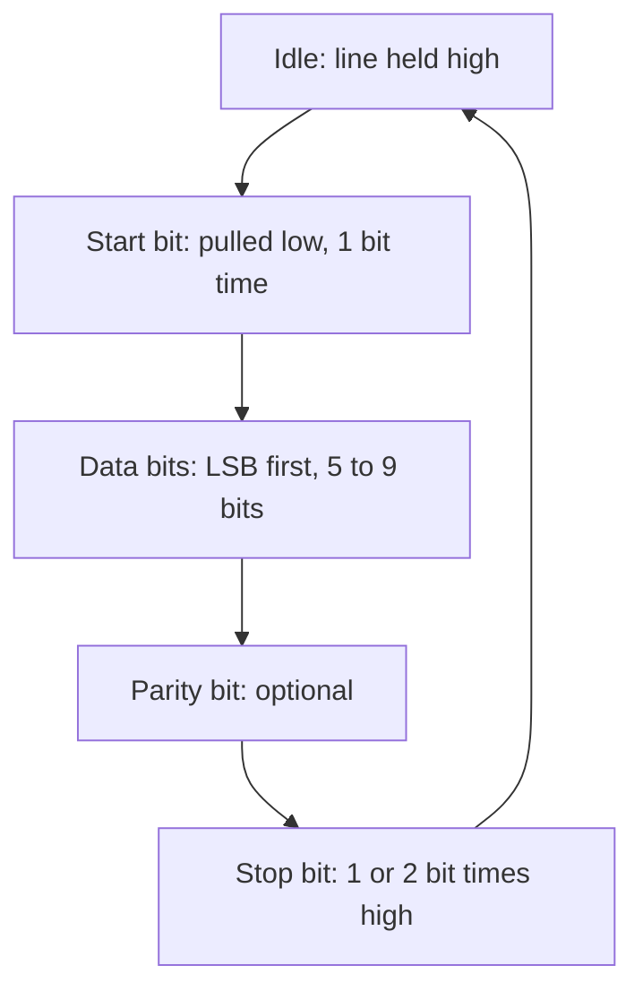

*Every hardware hack starts with a conversation. UART is usually the device speaking first. This series is about understanding that conversation, breaking it, and then rebuilding it stronger.*

---

### <span style="color: orange;">What UART Actually Is</span>

UART is not a bus. There is no clock line. There is no addressing. Two endpoints agree on a bit rate in advance and then fire voltages at each other.

That is the entire protocol:



The bit time is `1 / baud_rate` seconds. At 115200 baud, each bit is 8.68 microseconds. The receiver samples in the middle of each bit time. If your baud guess is off by more than roughly 2.5 percent, the sample drifts out of the bit cell and you get garbage.

That intolerance is the first thing an attacker exploits. Pick the right baud and the device starts narrating its own boot process.

---

### <span style="color: orange;">Deep Dive: What A Bit Actually Looks Like On The Wire</span>

The transmitter is a push-pull totem-pole output. It drives the line to VCC for a logical 1 and to GND for a logical 0. That is it. There is no differential, no encoding, no clock recovery.

A single byte 0x55 (binary 01010101) at 115200 8N1 looks like this on a scope:

```
         start  b0 b1 b2 b3 b4 b5 b6 b7  stop
VCC  ____|      __    __    __    __  __|_____
         |     |  |  |  |  |  |  |  |  |
   0 ----|-----|--|--|--|--|--|--|--|--|-----
         |__|  |  |__|  |__|  |__|  |
        start                          stop
       8.68us per bit
```

Reading left to right: line idle high, drop for the 1-bit-time start, then eight data bits LSB-first (so 0x55 is transmitted as 1,0,1,0,1,0,1,0), then stop bit high. Ten symbol times total (8N1 means 8 data + no parity + 1 stop, plus the implicit start).

Key consequences:

- **Framing is self-synchronizing per byte.** The receiver's clock re-aligns at every start-bit edge. Small clock drift between transmitter and receiver only matters over one byte's worth of time. After 10 bits the receiver resyncs.
- **The LSB comes first.** If you see bytes like 0xAA instead of 0x55, you are reading MSB-first. Some logic analyzers default to MSB-first UART decoders. Flip the setting.
- **Stop bit is a line-idle period, not data.** "2 stop bits" just means "guarantee 2 bit times of idle before the next start". The receiver does not care how long the line stays idle beyond the minimum.
- **Break condition.** If the line is held low for longer than one frame (10+ bit times at 115200), the receiver reports a BREAK. This is used for console attention on some kernels (Magic SysRq via serial) and for out-of-band signaling. Generating a BREAK is a software trick: set the UART to 9600 baud momentarily and send 0x00, or use `ioctl(fd, TIOCSBRK)`.

---

### <span style="color: orange;">Pull-Up and Pull-Down Resistors: Why They Matter For UART</span>

The single biggest cause of "I have the right baud but I see garbage or nothing" on unknown hardware is wrong resistor biasing on the line. Here is why.

**Idle state is HIGH.** UART convention says the line sits at VCC when no one is transmitting. If the transmitter is disabled (or not installed, or tri-stated during boot), the line floats. A floating line is not high. It is undefined. It picks up noise from nearby traces, 50/60 Hz mains hum, your body, anything. The receiver sees random transitions and interprets them as garbage start bits.

**The pull-up resistor fixes this.** A resistor (typically 10 kOhm) from the line to VCC pulls the line to VCC whenever no active driver is present. The active transmitter, when it wants to send a 0, easily overpowers the 10 k pull-up because its low-side transistor has sub-100-ohm on-resistance. So:

- Idle (no driver): 10 k pull-up wins, line is at VCC, receiver sees idle.
- Transmitter drives 1: pushes line to VCC, pull-up agrees, no contention.
- Transmitter drives 0: pushes line to GND through a small resistance. Pull-up tries to pull up but loses. Line is at GND. Receiver sees 0.

A pull-up is mandatory on:

- Any line shared by multiple drivers (half-duplex single-wire UART).
- Any line where the driver tri-states during certain boot phases.
- Any line routed to a header that may be unpopulated.

**Pull-down resistors are the opposite.** A pull-down resistor to GND ties the line low when nothing drives it. For standard UART this is wrong: idle should be high, not low. So you rarely want a pull-down on a UART data line.

Where pull-downs appear in UART contexts:

- On the CTS/RTS flow-control lines of some systems where "no flow control request" is the low state.
- On strap pins that share function with UART during boot (e.g., ESP32 GPIO0 acts as a boot-mode strap at reset, pulled down forces download mode; after boot it can be the U0TXD line).
- On the transmitter's enable pin for RS-485 converters, where pull-down holds the driver in receive mode by default.

**Practical attacker use of resistors:**

- If the device's UART TX is tri-stated during boot, adding your own 10 k pull-up from TX to VCC on the devkit lets you see the boot log clearly. Without it, you see noise.
- If the device's UART RX is not being driven by you but you want to hold it high (so your spurious noise does not register as input), add 10 k to VCC on RX.
- If the board has a footprint for a missing pull-up resistor (visible empty 0402 footprint near the UART header), install one. This is a very common fix.
- Some vendors leave the UART RX pin multiplexed with a GPIO that is configured as input with internal pull-up. If you short RX to GND while pulling the internal pull-up through 2 kOhm, the line settles at an intermediate voltage that some receivers interpret incorrectly. Force a clean hard pull to VCC through 4.7 k and it works.

**Pull resistor value selection (for completeness):**

- Too strong (small ohms, say 1 k): the active transmitter wastes current fighting the pull-up, edges look slow.
- Too weak (large ohms, say 100 k): the pull-up cannot charge the line capacitance fast enough, edges look slow and noise dominates.
- Sweet spot for 3.3V UART at 115200 on short wires: 4.7 k to 22 k. The 10 k "default" is almost always fine.

For high-speed UART (> 1 Mbaud) over long cables, the RC time constant matters. A 10 k pull-up with 50 pF line capacitance gives a 500 ns rise time, which is acceptable at 115200 (one bit is 8.68 us) but marginal at 1.5 Mbaud (one bit is 667 ns). Drop to 2.2 k at high speeds.

**Internal vs external pulls.** Most SoC GPIOs include a software-configurable internal pull-up or pull-down (typically 40 to 100 k, weaker than external). A UART peripheral set to input mode can have internal pull-up enabled via a config register. But internal pulls are weak. For a clean signal on a long jumper wire or in a noisy environment, always prefer external.

---

### <span style="color: orange;">Parity Bits: The 1-Bit Error Detector Nobody Talks About Carefully</span>


Parity is the oldest error-detection scheme on serial lines, and it still ships in every UART peripheral built in 2026. Five modes, one job: detect a single bit flip on the wire.

**The arithmetic.** For an 8-bit data byte, count how many of those 8 bits are 1. Call that count `n`. The parity bit is then:

- EVEN parity: set parity = 0 if n is even, 1 if n is odd. Total count including parity is always even.
- ODD parity: set parity = 1 if n is even, 0 if n is odd. Total count including parity is always odd.
- MARK parity: parity = 1 always, regardless of data.
- SPACE parity: parity = 0 always, regardless of data.
- NO parity: no parity bit transmitted, the frame is one bit shorter.

**What the hardware does in silicon.** A single XOR reduction tree over the 8 data bits produces `p_calc` in one gate delay. The receiver compares `p_calc` against the bit it sampled in the parity-bit position. Mismatch sets the PE (parity error) flag in the status register.

**Example with 0x41 ('A') = 0b01000001.** Two 1-bits. To make the total even: parity = 0. To make the total odd: parity = 1. MARK: 1. SPACE: 0. That is all there is.

**What it catches:**

- Any single-bit flip on the line: 100% detected.
- Any odd number of bit flips (3, 5, 7): detected.
- Random noise corrupting a frame: 50% detection probability (half the corruptions are even-count).

**What it misses:**

- Any even number of bit flips (2, 4, 6, 8): silently passes as valid.
- Cannot correct errors, only detect.
- Cannot locate the flipped bit.
- A deliberate attacker who flips pairs of bits passes every parity check.

**Why attackers care about parity configuration:**

- **Baud is right, every other byte is garbage**: almost always a parity mismatch. 8N1 on your side talking to 8E1 on the device is the #1 cause. Try all five modes before concluding the baud is wrong.
- **Parity error without byte delivery**: on Linux with `IGNPAR` clear and `INPCK` set, a byte with bad parity is dropped. The IRQ still fires. You can trigger kernel UART error paths without userland seeing input. Specific driver bugs live in these paths.
- **Parity error as byte-substitution primitive**: on Linux with `IGNPAR` clear but `PARMRK` set, bad-parity bytes are delivered as the three-byte sequence `0xFF 0x00 <byte>`. Crafting frames with deliberately-wrong parity becomes a way to inject `0xFF` bytes into a stream that normally filters them. Real exploit primitive against shells that use `0xFF` as a sentinel.
- **Parity bit glitching**: during the parity sample window (a known offset from the start-bit edge), a voltage glitch on the line flips PE without flipping any data bit. Receiver sees "byte arrived but corrupt". Depending on the driver, the byte may still land in the buffer. Asymmetric: the sender thinks the byte was rejected, the receiver has it. Useful for desync attacks.
- **MARK/SPACE parity as 9th data bit**: some proprietary multi-drop protocols abuse MARK/SPACE parity as an address-vs-data selector. Setting MARK means "this byte is an address". Switching parity between MARK and SPACE mid-stream lets you send address frames that non-addressed nodes ignore entirely. Reverse engineering such links requires you to flip parity in userland on the fly, which is a `tcsetattr()` call per byte.

**Gotcha: parity count conventions.** Some devices use 7E1 (7 data + even parity + 1 stop) as the "default" for text-only consoles. This is a ASCII-era holdover since 7 bits covered the whole printable set and the 8th bit was wasted. Industrial gear built on RS-485 still uses 7E1 because the standard specified it. You will hit it eventually.

**Gotcha: FIFO parity error handling varies.** On the same silicon family, different errata revisions handle a parity-errored byte differently. Some overwrite the byte with 0xFF in the FIFO. Some mark the FIFO slot as errored and skip it on read. Some pass it through unchanged. Check the SoC's UART errata sheet when you see weird behavior under intentional parity corruption.

---

### <span style="color: orange;">Voltage Levels, Rise Time, And Why Your Cheap Dongle Works (Or Does Not)</span>

The receiver samples in the middle of each bit time. For that sample to be correct, the line must have reached a valid logic level by the sample point. A "valid 1" on 3.3V CMOS is typically VCC * 0.7 = 2.31 V and above. A "valid 0" is VCC * 0.3 = 0.99 V and below. Between those is undefined.

Rise time constraints:

- At 115200 baud, one bit is 8.68 us. The sample is at 4.34 us. The line must be valid well before 4.34 us from the edge.
- Line capacitance on 10 cm of jumper wire is around 10 pF. Plus receiver input capacitance (3 to 10 pF). Call it 20 pF total.
- With a 50 ohm driver output impedance, RC = 1 ns. Not a problem.
- With only a 10 k pull-up pulling a tri-stated line, RC = 200 ns. Still not a problem at 115200.

But with 2 meters of unshielded wire (200 pF) and only a pull-up (no active driver during idle), RC = 2 us. At 115200 your rising edges take a quarter of a bit time to complete. Borderline. At 921600 you are dead.

This is why level shifters, properly buffered UART adapters, and short wires matter. The cheap CH340 dongles have weak drive (around 12 mA) and no programmable slew rate. An FT232H has stronger drive and handles long wires better. If you are having intermittent problems, swap adapters before blaming the target.

---

### <span style="color: orange;">The Receiver's State Machine, In Enough Detail To Debug</span>

When the receiver's input goes low after an idle period, the receiver starts a state machine:

1. **Verify start bit.** At t = 0.5 bit times (midpoint of the start bit), re-sample. If still low, confirmed start. If high, glitch, reset to idle.
2. **Sample 8 data bits.** At t = 1.5, 2.5, ..., 8.5 bit times, sample. These bits are shifted LSB-first into a data register.
3. **Sample parity bit** (if configured). Compute parity over the 8 data bits. Compare. If mismatch, set parity error flag.
4. **Verify stop bit(s).** At t = 9.5 bit times (and 10.5 for 2-stop-bit), the line must be high. If low, framing error.
5. **Transfer byte to FIFO.** If no errors, push byte into the hardware receive FIFO. Raise an interrupt if FIFO crossed the trigger threshold.

Consequences for attackers:

- **A framing error leaves the FIFO untouched.** You can send bytes that cause framing errors to provoke specific error-handler paths in the kernel without the byte reaching userland. Sometimes those error paths have interesting side effects.
- **Parity errors produce an interrupt but optionally still deliver the byte.** Some drivers deliver parity-error bytes replaced with a marker (0xFF by default on Linux with IGNPAR clear). This can be used to inject specific byte values into an input stream by crafting the parity yourself.
- **Sampling is fixed at bit-center.** If you perturb the bit shape such that the center sample lands in the ambiguous region, you can sometimes get the receiver to flip a specific bit while others pass correctly. This is a rare attack but real.

The oversampling rate on modern UART peripherals is 8x or 16x per bit, with majority voting across the central 3 samples. This adds noise immunity but also changes the attacker's glitch window.

---

### <span style="color: orange;">Finding TX, RX, GND on an Unknown Board</span>

Typical targets: IP cameras, home routers, smart plugs, industrial gateways. The pads are almost always there. Manufacturers use them in the factory and never disable them.

Visual signs of UART:

- A row of 3 or 4 through-hole pads or test points near the SoC
- Silkscreen labels like `J1`, `TP1`, `CON1`, `DEBUG`, `TTL`, or raw `TX RX GND VCC`
- Unpopulated 0.1" header footprints
- Tiny test pads in a straight line on the bottom side

With the board powered off, use a multimeter in continuity mode:

1. Find GND first. It connects to the large ground plane, the shield of USB/Ethernet, and to the negative of the main capacitor. One beep confirms.
2. VCC is next. Often 3.3V, sometimes 1.8V. Measure voltage after power-up.
3. The remaining two pads are TX and RX candidates.

With the board powered on, use an oscilloscope or logic analyzer:

- TX from the device will show activity during boot (bursts of transitions as the bootloader prints).
- RX into the device is quiet (the device is receiving, no traffic until you send).
- Idle voltage on both should match VCC (high = idle for standard UART).

If you do not own a scope, a cheap logic analyzer clone (Saleae-compatible, 24 MHz, around 10 USD) plus `sigrok` or `PulseView` will do the job.

**Voltage warning**: do not connect a 5V FTDI cable to a 3.3V UART directly on TX-into-device. Many devices tolerate it, some do not. Use a 3.3V adapter or a level shifter.

---

### <span style="color: orange;">Baud Rate: The Math That Matters</span>

The common baud rates you will meet: 9600, 19200, 38400, 57600, 74880 (ESP8266 ROM), 115200, 230400, 460800, 921600, 1500000.

How the device picks one: it is almost always a divisor of the UART peripheral's base clock.

```
baud = peripheral_clock / (16 * divisor)
```

With a 16 MHz peripheral clock, divisor of 1 gives 1,000,000 baud. Divisor of 104 gives 9615 (rounded to 9600). The set of "reasonable" bauds is small and that is why brute force works.

Two useful observations:

- Many HiSilicon SoCs boot at **115200**.
- Many MediaTek SoCs boot at **57600**.
- Some Espressif ROMs start at **74880** then switch to 115200.
- Some consumer routers are locked to oddball rates like **38400** or **1500000** to deter casual sniffing. This is security through bit-timing-obscurity and it does not work.

---

### <span style="color: orange;">Brute Force, The Right Way</span>

The lazy way is to try bauds one by one in a terminal and eyeball the output. That works, and it is fine for a first pass. The better way measures the actual bit time on the wire and calculates the baud from that.

**Method 1: Oscilloscope shortest pulse.**
Capture the first few milliseconds of boot output. Find the narrowest pulse. That width is one bit time. Baud is `1 / bit_time`.

A 8.68 microsecond narrowest pulse means 115200 baud. A 26.04 microsecond pulse means 38400. Done, first try, no guessing.

**Method 2: Logic analyzer with sigrok.**

```bash
sigrok-cli -d fx2lafw --channels D0 --config samplerate=4m \
    --time 2000 --output-format csv -o uart_capture.csv
```

Import into Pulseview, add the UART decoder, and it will autodetect the rate if you slide the baud guess close enough. Or run a small Python script over the capture that measures the shortest high-to-low to low-to-high interval.

**Method 3: Scripted brute force when you only have a USB-serial dongle.**
A small Python loop that opens the port at each candidate baud, reads 200 ms of bytes, scores the result on the ratio of printable ASCII to total bytes, and prints the top three:

```python
import serial, string, time

PORT = "/dev/ttyUSB0"
CANDIDATES = [9600, 19200, 38400, 57600, 74880, 115200,
              230400, 460800, 921600, 1500000]
PRINTABLE = set(bytes(string.printable, "ascii"))

def score(data: bytes) -> float:
    if not data: return 0.0
    hits = sum(1 for b in data if b in PRINTABLE)
    return hits / len(data)

results = []
for baud in CANDIDATES:
    try:
        s = serial.Serial(PORT, baud, timeout=0.2)
        time.sleep(0.1)
        data = s.read(512)
        s.close()
        results.append((score(data), baud, data[:80]))
    except Exception as e:
        results.append((0.0, baud, str(e).encode()))

for sc, b, sample in sorted(results, reverse=True)[:3]:
    print(f"{b:>8} baud  score={sc:.2f}  sample={sample!r}")
```

On a device I was profiling last week this pointed at 115200 with score 0.96, and 57600 with score 0.11 (chance ASCII collisions). No ambiguity.

**Method 4: Mark-space timing through /dev/ttyUSB0.**
Linux's serial driver can report line idle time. Open at a very high oversample baud like 3 Mbaud, read raw, and measure inter-transition times in the captured stream. Noisy, but works without extra hardware.

---

### <span style="color: orange;">Bit-Level Gotchas That Burn Hours</span>

- **8N1 vs 8E1 vs 7E1**: default is 8 data, no parity, 1 stop. A few industrial devices use 8E1 or 7E1. If your baud is right but every second character is wrong, try changing parity.
- **Inverted logic**: some serial-over-RS232 gear is inverted (idle low instead of idle high). The FTDI driver has an invert flag.
- **3.3V vs 1.8V**: modern SoCs (MediaTek MT7981, some Allwinner) use 1.8V UART. A 3.3V FTDI on TX-into-device may not damage the SoC but may backpower it through the TX line, causing weird half-boots. Use a 1.8V adapter.
- **Line noise on long wires**: keep jumper wires under 15 cm at 115200+. Twisted pair for TX/GND and RX/GND if you must go longer.
- **Shared RX/TX (single-wire UART)**: some ARM Cortex-M chips support it. If you only see three pads including GND, you may be on a half-duplex line.

---

### <span style="color: orange;">What You Get When You Get It Right</span>

First successful connection on an unknown device usually looks like this:

```
U-Boot 2016.11 (Jan 14 2020 - 18:22:04)

DRAM:  64 MiB
NAND:  128 MiB
In:    serial
Out:   serial
Err:   serial
Net:   eth0
Hit any key to stop autoboot:  3
```

That `Hit any key to stop autoboot` line is the invitation. Part 2 of this series is what you do with it.

The thing to note at this point: you did not need a CVE, a firmware dump, a signing key, or any software vulnerability to get here. You needed a multimeter, a 3 USD USB-serial adapter, and patience with bit timings.

UART is the lowest-friction attack surface on the entire IoT fleet. It has been for twenty years and it still is.

---

*Next in the series:*
*[Part 2: U-Boot Arg Injection and init=/bin/sh](/blog/uart-attacks-part2-boot-args-injection) (coming up)*
*Part 3: Login and Password Bypass*
*Part 4: Fault Injection Against UART-Locked Devices*
*Part 5: EMFI to Unlock a Silenced UART*
